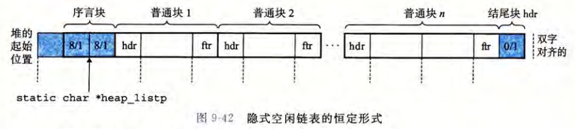
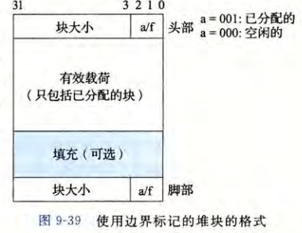
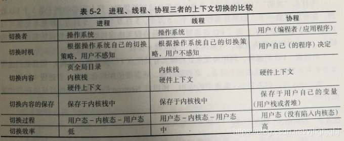
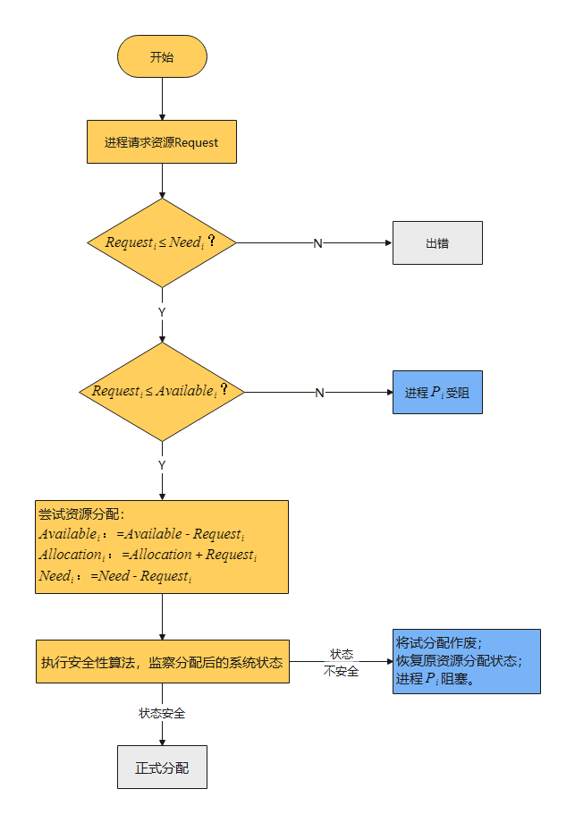

# 算法

## 机器学习

### 决策树+随机森林+GBDT+XGBoost

bagging：弱分类器之间采取投票或加权的方式组合成强分类器。弱分类器之间没有强依赖关系，可以并行生成。

boosting：弱分类器之间是有强依赖关系，需要序列化生成。

随机森林 是bagging的典型算法

adaboost  GBDT   XGBoost  都是 boosting典型算法

GBDT https://zhuanlan.zhihu.com/p/280222403

- CART 回归树（提升树）
- 负梯度近似残差
- boosting

XGBoost https://zhuanlan.zhihu.com/p/162001079

- 在GBDT的损失函数（均方误差）基础上增加了 正则项

## 机器人控制

### 阻抗控制与导纳控制

https://www.cnblogs.com/21207-iHome/p/9242948.html

机器人交互控制分为直接力控(Direct Force Control)、间接力控(Indirect Force Control)和力位混合控制(Hybrid Position/Force Control)。间接力控又分为主动和被动柔顺控制(Compliance Control)以及在关节空间和笛卡尔空间阻抗控制(Impedance Control)。

阻抗控制的控制目的就是为了让被控对象体现出弹簧阻尼的特性，不一定是针对关节空间。

阻抗控制器：输入位置，输出力、力矩

导纳控制器：输入力、力矩，输出位置

针对导纳控制器，通过调整 K，D 参数，可以改变实验特性，增加 K 时，单位作用力上产生的位移就变小，即需要用更大的力才能拉动关节；反之，减少 K 时，单位作用力上产生的位移就变大，用很小的力就能使关节产生较大的位移。增加 D 时，相当于增加系统的阻尼特性，可以进一步的提高系统运动时的平稳性，但如果 D 很大，可能出现系统响应很慢的情况，不能很好的跟随所施加的外力信息；另一方面，减少 D 时，可以适当的提高系统的快速性，但是过小的D 会引起系统的不稳定现象。

## 信号处理

### 滤波

一般滤波器可以分为经典滤波器和数字滤波器。

1. 经典滤波器：假定输入信号中的有用成分和希望去除的成分各自占有不同的频带。如果信号和噪声的频谱相互重迭，经典滤波器无能为力。比如 FIR 和 IIR 滤波器等。　　
2. 现代滤波器：从含有噪声的时间序列中估计出信号的某些特征或信号本身。现代滤波器将信号和噪声都视为随机信号。包括 Wiener Filter、Kalman Filter、线性预测器、自适应滤波器等

#### 卷积

https://zhuanlan.zhihu.com/p/526705694

**时域的卷积等于频域相乘**

**频域的卷积等于时域相乘**

**不同频率的正弦信号的时域卷积为0**

#### FIR

FIR的方程中，当前输出y(n)是由**当前输入x(n)、过去输入x(n-1)、x(n-2)...这两类值共同决定的。FIR就是**无反馈、非递归**的**。

因为在FIR滤波器中，每一时刻的输出取决于之前的有限个输入，**因此就是“有限冲激响应”。**

FIR的极点全部在原点（z变换），是稳定的。

FIR的相位延迟是线性的。

https://zhuanlan.zhihu.com/p/523565858

FIR设计方法有窗函数法、等波纹最佳逼近法

窗函数法：因为理想低通滤波器的时域响应是一个sinc函数类型的，但是这个时域上sinc函数的系统是非因果的且非稳定的，所以考虑在sinc函数上加窗截断使之稳定，并且平移，使之成为因果系统。经过验证，加窗截断并平移之后，其频域响应依然可以体现低通的效果，因此说明窗函数法是可行的。

窗函数有① 矩形窗：标准的对sinc函数进行截断和平移 ②汉宁窗：这是一个升余弦窗（与矩形窗相比衰减要快一点，长度增加，主瓣越窄） ③汉明窗：海明窗和汉宁窗很像，不同的是它有一部分是不连续的 ④高斯窗：

等波纹最佳逼近法的最优逼近，是指在滤波器长度已知的情况下，通过加权优化的方法，使得纹波误差的值达到最小。因此，在相同阶数的情况下，基于等波纹最佳逼近法的FIR数字滤波器的通带衰减最小，阻带衰减最大。而在相同性能的情况下，基于等波纹最佳逼近法的FIR数字滤波器的阶数可以达到最小。

#### IIR

IIR的方程中，当前输出y(n)是由**当前输入x(n)、过去输入x(n-1)、x(n-2)...、过去输出y(n-1)、y(n-2)...这三类值共同决定的。**IIR的当前输出受到以前输出值的影响，所以它是有**反馈**的。也因此由于本步骤的输出会作为下一步骤的输入，无限递归下去，所以一个时刻的影响就是无限的，**也就是“无限冲激响应”。**

https://www.cnblogs.com/21207-iHome/p/7059144.html

IIR不一定稳定。

IIR的相位延迟是非线性的。

IIR种类：

- 巴特沃斯：最大平坦滤波器，特点是[通频带](https://baike.baidu.com/item/通频带)内的频率响应曲线最大限度平坦，没有起伏，而在阻频带则逐渐下降为零。
- 切比雪夫Ⅰ型滤波器：与巴特沃斯相比的话信号衰减要快一点，但是在通频带内存在幅度波动，存在纹波。
- 切比雪夫II型滤波器：在通频带内是平坦的，但是在阻频带存在纹波。
- 椭圆滤波器：过渡带信号衰减快，在通频带阻频带都有纹波

#### IIR和FIR的区别

从效率、选择性上比较：
IIR滤波器：存在反馈，因而可用比FIR滤波器较少的阶数来满足指标要求。存储单元少，运算次数少，较为经济
FIR滤波器：不存在反馈，只能用较高的阶数达到高的选择性
从稳定性上比较：
IIR滤波器：传输函数的极点可位于单位圆内的任何地方，有稳定性的问题
FIR滤波器：传输函数的极点固定在原点上，不存在稳定性的问题
从性能上比较：
IIR滤波器：高效率（高效性体现在：以较低的阶数达到指标）是以相位的非线性为代价。
FIR滤波器：可以得到严格的线性相位，这一点可能更适合语音信号等对相位要求比较严格的场景
从结构上比较
IIR滤波器：必须采用递归结构，极点位置必须在单位圆内。递归结构中，运算四舍五入处理，有时会引起寄生震荡
FIR滤波器：主要采用非递归结构，不存在稳定性问题，运算误差也小

#### FFT

求功率谱就有两种方法：1.(傅立叶变换的平方)/(区间长度)；2.自相关函数的傅里叶变换。这两种方法分别叫做直接法和相关函数法。

**所有周期信号都是功率信号；所有有限数量的脉冲信号都是能量信号。**


# C++

## 内存分配

内存分配

- 栈区：调用函数过程中使用到的局部变量和函数参数
- 文件映射区与匿名映射区：动态链接库中的代码段，数据段，BSS 段，以及通过 mmap 系统调用映射的共享内存区，在虚拟内存空间的存储区域叫做文件映射与匿名映射区。
- 堆区：用来动态申请和释放的内存区
- BSS段：用来存放没有初始化的全局变量和静态变量，这些变量在被加载到内存时会初始化为0
- 数据段：用来存放已经初始化了的全局变量和静态变量
- 代码段：存放进程程序二进制文件中的机器指令

## 智能指针

智能指针原理与简单实现 https://blog.csdn.net/xiaoyaolangwj/article/details/129612435

### unique_ptr：独占指针

- 同⼀时刻只能有⼀个 unique_ptr 指向给定对象；
- 离开作⽤域时，若其指向对象，则自动将其所指对象销毁（默认delete）；
- 只可以move，不可以copy

实现了运算符 `*` 和 `->` 运算符的重载。

```cpp
/*创建*/
//构建unique_ptr方式1，需要delete 原始指针
Cat *c_p2 = new Cat("yz");
std::unique_ptr<Cat> u_c_p2{c_p2};
delete c_p2;
c_p2 = nullptr;
u_c_p2->cat_info();

//构建unique_ptr方式2
std::unique_ptr<Cat> u_c_p3{new Cat("dd")};
u_c_p3->cat_info();
u_c_p3->set_cat_name("oo");
u_c_p3->cat_info();

//构建unique_ptr方式3
std::unique_ptr<Cat>u_c_p4 = make_unique<Cat>();
u_c_p4->set_cat_name("oo");
u_c_p4->cat_info();

/*常用方法*/
//get方法：获得指针指向的地址
std::unique_ptr<Cat> u_p1 = std::make_unique<Cat>();
Cat* p2 = nullptr;
p2 = u_p1.get(); // p2也指向了Cat，u_p1并不释放
//relase方法：
p2 = u_p1.release(); // p2也指向了Cat，u_p1释放
// reset方法；将智能指针指向0，如果该智能指针为const，则不能调用这个方法
u_p1.reset();// u_p1释放指向0：u_p1.get()为0

/*传递方式*/
//函数调用时 值传递 需要调用std::move()
void pass_value(std::unique_ptr<Cat> p){
    p->method();
}
std::unique_ptr<Cat> u_p1 = std::make_unique<Cat>();
pass_value(std::move(u_p1));
//函数调用时，引用传递，不需要move
void pass_ref(std::unique_ptr<Cat>& p){
    p->method();
}
std::unique_ptr<Cat> u_p1 = std::make_unique<Cat>();
pass_value(u_p1);
```

### shared_ptr：共享指针

- 可以copy，shared_ptr创建一个计数器与类对象进行关联，copy则计数器的值+1，销毁则计数器的值-1，可以通过`use_count()`得到有多少个shared_ptr指向该对象；

- 当计数器的值为0的时候才会调用析构

- shared_ptr passed by value 计数+1，shared_ptr passed by ref 计数不改变

- unique_ptr可以转换为shared_ptr 

  ```cpp
  std::unique_ptr<Cat> p1 = std::make_unique<Cat>(); 
  std::shared_ptr<Cat> p2 = std::move(p1);
  ```


### weak_ptr：配合shared_ptr

-  weak_ptr没有所有权，不能调用 `->` 和 `*`
- 可以调用 use_count 但是 计数器并不会＋1
- 可以通过 `.lock()`将 weak_ptr 类型转换为 shared_ptr
- 用于解决循环依赖问题： 

```cpp
#include "utils.hpp"
class Cat {
 private:
  std::string m_name = "hhh";
  std::weak_ptr<Cat> m_friend;

 public:
  Cat() { std::cout << "Constructor: " << this->m_name << std::endl; }
  Cat(std::string name) {
    this->m_name = name;
    std::cout << "Constructor: " << this->m_name << std::endl;
  }
  Cat(Cat& c) {
    this->m_name = c.m_name;
    this->m_friend = c.m_friend;
    std::cout << "Constructor: " << this->m_name << std::endl;
  }

  ~Cat() { std::cout << "Deconstructor: " << this->m_name << std::endl; }
  void set_friend(std::shared_ptr<Cat>& c) {
    std::cout << c.use_count() << std::endl;
    this->m_friend = c;
  }
};

int main(int argc, char* agrv[]) {
  std::shared_ptr<Cat> c1 = std::make_shared<Cat>("c1");
  std::cout << c1.use_count() << std::endl;
  std::shared_ptr<Cat> c2 = std::make_shared<Cat>("c2");
  c1->set_friend(c2);
  std::cout << c1.use_count() << std::endl;
  c2->set_friend(c1);
  return 0;
}

/*
Constructor: c1
1
Constructor: c2
1
1
1
Deconstructor: c2
Deconstructor: c1
*/
```

### 智能指针（unique/shared）的简单实现

```cpp
#include <stdio.h>

#include <iostream>

using namespace std;

template <class T>
class SmartPoint {
  T* point;

 public:
  SmartPoint(T* ptr = nullptr) : point(ptr) {}

  ~SmartPoint() {
    if (point) {
      // 会调用point指向对象的的析构函数
      delete point;
    }
  }
  // 使用智能指针就像使用内部包裹的的对象一样
  T& operator*() { return *point; }

  T* operator->() { return point; }

  // 禁用拷贝构造和赋值构造
  SmartPoint(const SmartPoint& smp) = delete;
  SmartPoint& operator=(const SmartPoint& smp) = delete;
};

template <class T>
class SmartPoint_shared {
 private:
  T* point;
  int* _count_ptr;

 public:
  SmartPoint_shared(T* ptr = nullptr) {
    if (ptr) {
      point = ptr;
      _count_ptr = new int(1);
    } else {
      _count_ptr = new int(0);
    }
  }

  ~SmartPoint_shared() {
    (*_count_ptr)--;
    if ((*_count_ptr) == 0) {
      // 会调用point指向对象的的析构函数
      delete point;
      delete _count_ptr;
    }
  }
  // 使用智能指针就像使用内部包裹的的对象一样
  T& operator*() { return *point; }

  T* operator->() { return point; }

  // 拷贝构造和赋值运算符
  SmartPoint_shared(const SmartPoint_shared& smp) {
    // cout << "in copy constructor" << endl;
    if (&smp != this) {
      // cout << "in copy constructor if" << endl;

      this->point = smp.point;
      this->_count_ptr = smp._count_ptr;
      (*(this->_count_ptr))++;
      // cout << (*this->_count_ptr) << endl;
    }
    // cout << "copy constructor return" << endl;
  }
  SmartPoint_shared& operator=(const SmartPoint_shared& smp) {
    // cout << "in ==" << endl;
    if (this == &smp) {
      return *this;
    } else {
      this->point = smp.point;
      this->_count_ptr = smp._count_ptr;
      (*_count_ptr)++;
      return *this;
    }
  }

  int use_count() { return (*_count_ptr); }
};

class Demo {
 public:
  Demo() { printf("Constructor\n"); }
  ~Demo() { printf("Deconstructor\n"); }
  void show() { printf("hello\n"); }
};

class Demo2 {
  int s;
  static int demo2_count;

 public:
  Demo2() { printf("Constructor--2\n"); }
  ~Demo2() { printf("Deconstructor--2\n"); }
  void show() { printf("hello--2\n"); }
};

int Demo2::demo2_count = 0;

void test_unique_smp() {
  SmartPoint<Demo> smartPoint(new Demo());
  smartPoint->show();
  Demo& demo = *smartPoint;
  demo.show();
}

void test_shared_smp() {
  SmartPoint_shared<Demo> share_smp(new Demo());
  share_smp->show();
  Demo& demo = *share_smp;
  demo.show();
  cout << share_smp.use_count() << endl;
  SmartPoint_shared<Demo> share_smp_2(share_smp);
  share_smp_2->show();
  cout << share_smp_2.use_count() << endl;
  // share_smp_2 = share_smp;
  SmartPoint_shared<Demo> share_smp_3;
  share_smp_3 = share_smp;
  share_smp_3->show();
  cout << share_smp_3.use_count() << endl;

  SmartPoint_shared<Demo2> share_smp_4(new Demo2());
  share_smp_4->show();
  cout << share_smp_4.use_count() << endl;
}

int main() {
  Demo2 d;
  cout << sizeof(d) << endl;
  test_shared_smp();
}
```


## 野指针

野指针（Dangling Pointer）是指在程序中存在的指向已经释放或者无效的内存地址的指针。当程序中的指针被释放或者指向的内存被回收后，如果没有将指针置为NULL或者重新指向有效的内存地址，那么这个指针就变成了野指针。

使用野指针可能会导致严重的错误和未定义行为，因为它指向的内存地址可能已经被其他程序或者系统回收，这时对该地址进行读写操作会导致不可预测的行为，可能会导致程序崩溃或产生错误结果。

野指针的出现通常有以下几种情况：

1. 指针未初始化：当定义指针变量但未初始化时，该指针的值是不确定的，指向的地址可能是随机值，即野指针。
2. 指针指向已释放的内存：在手动管理内存的情况下，如果释放了一块内存区域，但没有将指针置为NULL或者重新指向其他有效的内存，那么该指针就变成了野指针。
3. 指针超出作用域：如果在函数内部定义的指针在函数返回后依然被使用，它就变成了野指针，因为函数退出后，其指向的内存已经无效。


## 函数的重载与重写

重载是指同一可访问区内被声明的几个具有不同参数列（参数的类型，个数，顺序不同）的同名函数，根据参数列表确定调用哪个函数，重载不关心函数返回类型。

重写是指派生类中存在重新定义的函数。其函数名，参数列表，返回值类型，所有都必须同基类中被重写的函数一致。只有函数体不同（花括号内），派生类调用时会调用派生类的重写函数，不会调用被重写函数。重写的基类中被重写的函数必须有virtual修饰。

## RAII

RAII（**R**esource **A**cquisition **I**s **I**nitialization），主要用于管理资源的申请和释放。避免因为忘记释放资源而造成内存泄露等问题。

https://zhuanlan.zhihu.com/p/394119741

RAII实现智能指针(unique_ptr)

```cpp
#include<iostream>
#include<stdio.h>
using namespace std;

template<class T>
class SmartPoint
{
    T* point;
public:
    SmartPoint(T *ptr = nullptr) :point(ptr) {}

    ~SmartPoint() {
        if (point) {
            // 会调用point指向对象的的析构函数
            delete point;
        }
    }
    // 使用智能指针就像使用内部包裹的的对象一样
    T& operator*() { 
        return *point; 
    }

    T* operator->() { 
        return point; 
    }
};

class Demo {
    public:
        Demo() {
            printf("执行构造函数\n");
        }
        ~Demo() {
            printf("执行析构函数\n");
        }
        void show() {
            printf("hello\n");
        }
};

int main() {
    SmartPoint<Demo> smartPoint(new Demo());
    smartPoint->show();
    Demo &demo = *smartPoint;
    demo.show();
}
```

RAII实现智能指针(shared_ptr)

```

```


## 指针与引用

指针存放某个对象的地址，其本⾝就是变量（命了名的对象），本⾝就有地址，所以可以有指向指针的指针；可变，包括其所**指向的地址**的改变和**其指向的地址中所存放的数据**的改变。

引⽤就是变量的别名，从⼀⽽终，不可变，在创建时必须初始化。

C++ 引用 vs 指针，有三个主要的不同：

- 不存在空引用。引用必须连接到一块合法的内存。但是存在指向空值的指针
- 一旦引用被初始化为一个对象，就不能被指向到另一个对象。指针可以在任何时候指向到另一个对象。
- 引用必须在创建时被初始化。指针可以在任何时间被初始化。

## 值传递、指针传递、引用传递

首先说明的是，参数传递的本质是函数调用栈的参数的copy。

- 值传递：形参是实参的一份临时拷贝，形参和实参分别占不同的地址，对形参的修改不会影响实参。
- 指针传递：指针传递本质上也是值传递。传址调用是把函数外部创建变量的内存地址传递给函数参数的一种调用函数的方式。这种传参方式可以让函数和函数外边的变量建立起真正的联系，也就是函数内部可以直接操作函数外部的变量。
- 引用传递：引用相当于给参数取”别名“，两者占用同一个地址，修改”别名“，也会修改原有的参数。

#### 值传递和引用传递的区别

- 值传递的过程：传值方式会带来一次额外的对象拷贝构造函数调用开销，在pass_by_value中，编译器会调用T的拷贝构造函数从t0构造出一个新的临时的T对象用作pass_by_value的参数，这个对象在函数pass_by_value函数调用结束后会自动析构。
- 引用传递的过程：引用传递则不会有上述的拷贝构造的开销，类似于传递地址。

#### 引用传递和指针传递的区别

https://www.cnblogs.com/CheeseZH/p/5163200.html

指针：变量，独立，可变，可空，替身，无类型检查；

引用：别名，依赖，不变，非空，本体，有类型检查；

相同点：

　　都是地址的概念

不同点：

1. 指针是一个实体（替身）；引用只是一个别名（本体的另一个名字）
2. 引用只能在定义时被初始化一次，之后不可改变，即“从一而终”；指针可以修改，即“见异思迁”；
3. 引用不能为空（有本体，才有别名）；指针可以为空；
4. sizeof 引用，得到的是所指向变量的大小；sizeof 指针，得到的是指针的大小；
5. 指针 ++，是指指针的地址自增；引用++是指所指变量自增；
6. 引用是类型安全的，引用过程会进行类型检查；指针不会进行安全检查；

## 右值引用（C++11新特性）

右值引用的好处：**提高效率，避免频繁的对象的构造和析构**。右值引用的引入使得我们可以利用右值的临时性质来提高性能，避免不必要的数据拷贝，并实现更灵活和通用的函数设计。例如，在函数传递参数时，可以使用右值引用来接收临时对象或通过std::move()将左值转换为右值引用，从而触发移动语义，避免不必要的拷贝操作。

左值（Lvalue）：

- 左值是指在内存中有确定地址的表达式。它们可以是具名变量、对象成员、数组元素、解引用指针等。
- 左值可以出现在赋值运算符的左侧或右侧。
- 左值可以被取地址（&）操作符获取其内存地址。
- 左值可以持久存在，可以在多个地方使用。

右值（Rvalue）：

- 右值是指在内存中没有确定地址的表达式。它们可以是字面量、临时对象、表达式的结果等。
- 右值只能出现在赋值运算符的右侧。
- 右值不能被取地址（&）操作符获取其内存地址。
- 右值通常是临时的，其生命周期很短暂。也称将亡值

区分什么是左值和右值，**有一个很好区分左值和右值的方式，就是是否可以对表达式取地址！！可以获取地址的表达式就是左值，且持久性变量都是左值，反之则是右值。**

左值引用和右值引用都是对象的别名而已，左值引用就是左值的别名，右值引用就是右值的别名。**所以左值引用只能绑定左值，右值引用只能绑定右值，我们不能将一个右值引用类型变量绑定到一个右值引用。因为变量都是左值！我们可以对右值引用类型变量取地址！**但是有一个例外，**const左值引用可以绑定到右值**。这看起来好像有点难以理解，我们用代码实际解释一下。

```cpp
int i = 42; //i是左值，可以对i取地址
int &r = i; //r是左值引用，绑定左值i
```

可以对变量i取地址，所以是i是左值。

```cpp
int &&rr = i; //错误！i是左值，不能绑定到右值引用rr
int &&rr3 = rr; //错误！！！！rr是一个右值引用类型的变量，是一个左值。
```

右值引用无法和右值引用类型变量绑定，因为**右值引用类型变量是一个左值**，**所有持久性变量都是左值。可以取地址的变量是持久性变量，反之是临时性变量。**那么是否可以用左值引用绑定右值引用类型变量吗？左值引用绑定左值引用类型变量？当然可以了。我们来看一下下面代码示例。

```cpp
int &r2 = rr; //正确，rr是右值引用类型变量，变量都是左值。
int &r3 = r; //正确，r是左值引用类型变量，变量都是左值。
```

接下来我们看一下表达式，**产生临时变量或字面常量的表达式都是右值，反之则是左值。**我们依旧拿代码作为示例。

```cpp
int &&rr_result = Add(1, 2); //不能对表达式取地址，所以表达式结果是一个右值，可以绑定到右值引用
int &&rr2 = i * 42; //不能对表达值取地址，所以表达式结果是右值，可以绑定到右值引用
int &&rr1 = 42; //不能对字面常量取地址，所以字面常量是右值，可以绑定到右值引用
```

Add函数产生一个临时变量，所以是右值。i * 42产生一个临时变量，是右值。42则是字面常量，所以也是右值。

```cpp
int result = 0;
int *ptr = &(result = i * 12); //正确，可以对result取地址
int& r3 = (result = i * 12); //正确，表达式的结果存储在变量result中，可以对表达式取地址
```

result = i * 12表达式结果存储在result中，可以对result取地址，所以表达式是左值。

```cpp
const int &r2 = i * 42; //不能对表达值取地址，所以表达式结果是右值，可以绑定到const左值引用
```

i * 42是一个右值，但是const左值引用类型可以绑定到右值上。

## 移动语义

右值引用可以延长右值的生命周期，但这看起来似乎并没有太大的用处，c++11引入这个概念主要是为了实现移动语义，避免拷贝，从而提升程序的性能。

**std::move其实并不move任何东西，它只做类型转换**，**返回实参的右值引用，从而可以调用右值版本的函数/方法**，其实叫rvalue_cast更合适。

移动语义通过引入右值引用（Rvalue reference）和移动构造函数（Move Constructor）以及移动赋值运算符（Move Assignment Operator）来实现。

移动语义的核心思想是**==将资源（如堆内存、文件句柄等）从一个对象转移到另一个对象，而不进行深拷贝==**。这对于临时对象、函数返回值和容器元素的管理非常有用。

移动构造

```cpp
class MyObject {
private:
    int* data;

public:
    // 构造函数
    MyObject() : data(nullptr) {
        std::cout << "Default Constructor" << std::endl;
    }

    // 移动构造函数
    MyObject(MyObject&& other) noexcept : data(other.data) {
        other.data = nullptr;
        std::cout << "Move Constructor" << std::endl;
    }

    // 移动赋值运算符
    MyObject& operator=(MyObject&& other) noexcept {
        if (this != &other) {
            delete data;
            data = other.data;
            other.data = nullptr;
        }
        std::cout << "Move Assignment Operator" << std::endl;
        return *this;
    }

    // 析构函数
    ~MyObject() {
        delete data;
        std::cout << "Destructor" << std::endl;
    }
};
```

拷贝构造

```cpp
class MyObject {
private:
    int* data;

public:
    // 构造函数
    MyObject() : data(nullptr) {
        std::cout << "Default Constructor" << std::endl;
    }

    // 拷贝构造函数
    MyObject(const MyObject& other) : data(new int(*other.data)) {
        std::cout << "Copy Constructor" << std::endl;
    }

    // 析构函数
    ~MyObject() {
        delete data;
        std::cout << "Destructor" << std::endl;
    }
};
```

## 万能引用与引用折叠

https://zhuanlan.zhihu.com/p/606580366

在模板编程中，**函数模版参数中的`T&&`中的T是函数模版变量时，这代表一个万能引用**，这其中还涉及到**引用折叠**

**引用折叠规则 **

```cpp
1.所有右值引用折叠到右值引用上仍然是一个右值引用。（A&& && 变成 A&&） 

2.所有的其他引用类型之间的折叠都将变成左值引用。 （A& & 变成 A&; A& && 变成 A&; A&& & 变成 A&）
```

先看下面的例子:

```cpp
#include <iostream>

using namespace std;

template<typename T>
void func(T& param) {
	cout << param << endl;
}

int main() {
	int a{100};
	func(a); // ok
	func(100); // error! candidate function [with T = int] not viable: expects an lvalue for 1st argument
}
```

func接受的是一个左值引用，所以func(a)这样的调用是ok的，但是func(100)会出错，因为100是个右值! 在这个例子里可以把func的实参类型改为`const T&`，因为const的左值引用是可以绑定右值的，但是，如果函数内部本身会修改param，那么也会无法实现。

万能引用(**universal reference**或**forwarding reference**)可以解决这个问题:

```text
#include <iostream>

using namespace std;

template<typename T>
void func(T&& param) { // 
	cout << param << endl;
}

int main() {
	int a{100};
	func(a); // ok
	func(100); // ok
}
```

这里的`T&& param`表示param是一个万能引用，如果传入的参数是左值，那么param就是左值引用(比如int&)，外部传入的是右值，param就是右值引用(比如int&&)。

## 完美转发

```text
template<typename T>
void func(const T& param) {
	vector<T> v;
	v.emplace_back(param);
}
```

在模版函数func内部，调用了v.emplace_back(param)，我们知道vector.emplace_back为左值和右值有两个不同的实现，左值会调用拷贝构造函数，而右值会调用移动构造函数，性能更好。那么按上面这个实现，因为func的参数类型是`const T&`，**一定是左值引用**，那么传给vector.emplace_back的，也是左值，所以即使调用func时传的参数是右值，在调用vector.emplace_back的时候也**只会调用到左值的版本**！

有了万能引用后，可以做如下改进

```text
template<typename T>
void func(T&& param) {
	vector<T> v;
	v.emplace_back(param);
}
```

但是！前面说过，**一个右值引用变量本身是一个左值**，这里的v.emplace_back(param)**依然会调用左值的版本**! 

这里就需要std::forward了，和std::move类似，**std::forward其实也是一个类型转换，当实参是左值引用时候，它返回的是左值引用，也就是没做任何事；实参是右值引用的时候，它返回的是右值引用。**所以，最终正确的版本应该是这样:

```text
template<typename T>
void func(T&& param) {
	vector<T> v;
	v.emplace_back(std::forward<T>(param));
}
```

这就是所谓的完美转发(perfect forwarding)。

### 疑问：std::forward()到底干了些啥？

std::forward的作用是转发，左值引用转发成左值引用，右值引用还是右值引用，刚开始一直想不通这个API的意义到底是什么？

原来是**在程序的执行过程中，对于引用的传递实际上会有额外的隐式的转化**，一个右值引用参数经过函数的调用转发可能会转化成左值引用，但这就不是我们希望看到的结果。

在上面的程序上进行修改

```cpp
#include <iostream>
#include <vector>
#include <string>

class A {
  public:
    A(){}
    A(size_t size): size(size), array((int*) malloc(size)) {
        std::cout 
          << "create Array，memory at: "  
          << array << std::endl;
        
    }
    ~A() {
        free(array);
    }
    A(A &&a) : array(a.array), size(a.size) {
        a.array = nullptr;
        std::cout 
          << "Array moved, memory at: " 
          << array 
          << std::endl;
    }
    A(A &a) : size(a.size) {
        array = (int*) malloc(a.size);
        for(int i = 0;i < a.size;i++)
            array[i] = a.array[i];
        std::cout 
          << "Array copied, memory at: " 
          << array << std::endl;
    }
    size_t size;
    int *array;
};
template<typename T>
void warp(T&& param) {
    if(std::is_rvalue_reference<decltype(param)>::value){
        std::cout<<"param is rvalue reference\n";
    }
    else std::cout<<"param is lvalue reference\n";
    A y = A(param);
    A z = A(std::forward<T>(param));
}
int main(){
    A a = A(100);
    warp(std::move(a));
    return 0;   
}

//----------------output----------------
// create Array，memory at: 0x600002e60000 //main函数中，A a = A(100);调用构造函数
// param is rvalue reference //使用了std::move，根据引用折叠规则，param是一个右值引用
// Array copied, memory at: 0x600002e60070 // A y = A(param); 可以看到调用的是拷贝的构造函数
// Array moved, memory at: 0x600002e60000。// A z = A(std::forward<T>(param)); 调用了移动构造函数
```

从程序的输出就可以看到，当一个右值引用再进行转发的时候，没使用std::forward进行二次转发的时候，实际上是会被隐式的转换，转发成一个左值引用，从而调用不符合期待的构造函数，带来额外的开销，所以std::forward的一个重要作用就是**完美转发，确保**转发过程中引用的类型不发生任何改变，**左值引用转发后一定还是左值引用，右值引用转发后一定还是右值引用**！

## 字节流


### 强制类型转换


## 关键字

### Auto

可以实现自动数据类型的推导。

### extern "C"

被 extern "C" 修饰的变量和函数是按照 `C` 语言方式编译和连接的。

https://zhuanlan.zhihu.com/p/123269132

### _Atomic

```cpp
#include <stdio.h>
#include <pthread.h>
_Atomic int a;
void* sum(){
    for(int i = ; i < 1000000; i++){
        a++; // a = a+1;这条语句则无法完成原子操作
    }
}

void test(){
    a=0;
    pthread_t t1,t2;
    pthread_create(&t1, NULL, sum, NULL);
    pthread_create(&t2, NULL, sum, NULL);
    pthread_join(t1, NULL);
    pthread_join(t2, NULL);
    printf("a = %d\n", a);
}

int main(){
    test();
    test();
    test();
}

```


### volatile

volatile 关键字是一种类型修饰符，用它声明的类型变量表示可以被某些编译器未知的因素更改，比如：操作系统、硬件或者其它线程等。因此，遇到这个关键字声明的变量，编译器对访问该变量的代码就不能再进行优化，从而可以提供对特殊地址的稳定访问。声明时语法：`int volatile vInt;` ==当要求使用 volatile 声明的变量值的时候，系统总是重新从它所在的内存读取数据，即使它前面的指令刚刚从该处读取过数据。而且读取的数据立刻被保存。==例如：

```
volatile int i = 10; 
int a = i;

...

// 其他代码，并未明确告诉编译器，对 i 进行过操作；
int b = i;
```

volatile 指出 i 是随时可能发生变化的，每次使用它的时候必须从 i 的地址中读取，因而编译器生成的汇编代码会重新从i的地址读取数据放在 b 中。而优化做法是，由于编译器发现两次从 i读数据的代码之间的代码没有对 i 进行过操作，它会自动把上次读的数据（例如从 a 中读到的数据）放在 b 中。而不是重新从 i 里面读。这样以来，如果 i是一个寄存器变量或者表示一个端口数据就容易出错，==所以说 volatile 可以保证对特殊地址的稳定访问==。

适用场景：

volatile一般在下面三场景中使用：

1、被多个进程共享的变量；

2、硬件寄存器；（主要是状态寄存器）

3、操作系统中的变量。

### const

c语言中const全局变量存储在只读数据段，编译期最初将其保存在符号表中，第一次使用时为其分配内存，在程序结束时释放。

而const局部变量（局部变量就是在函数中定义的一个const变量，）存储在栈中，代码块结束时释放

#### 修饰常量

被const修饰的必须是只读变量，定义时必须初始化。

常量指针：指向常量的指针，被指对象不能通过指针来修改，但是该指针可以指向其他变量。`const int * p;`

指针常量：指针为常量。指针本身在定义的时候初始化，并且不能被改变，不能指向别的变量。但是该指针指向的对象的指可以通过该指针来修改。`int * const p;`

#### 修饰类成员变量

- 只在某个对象的生命周期内是常量，而对该类实例化的全部对象而言是可变的
- 不能赋值，不能在类外定义;
- 只能通过==构造函数的参数初始化列表初始化==[原因:因为不同的对象对其const数据成员的值可以不同，所以不能在类中声明时初始化]

#### 修饰类成员函数

形式是 `int GetCount(void) const; // const 成员函数`

- 防止 const 成员函数修改对象的内容 [不能修改成员变量的值，但是可以访问]
- const成员函数  不可以  调用非const的函数
- const对象只能访问const成员函数,而非const对象可以访问任意的成员函数,包括const成员函数.
- const对象的成员是不可修改的,然而const对象通过指针维护的对象却是可以修改的.
- const成员函数不可以修改对象的数据,不管对象是否具有const性质.它在编译时,以是否修改成员数据为依据,进行检查.
- 然而加上mutable修饰符的数据成员,对于任何情况下通过任何手段都可修改,自然此时的const成员函数是可以修改它的
  


### static

#### C语言修饰变量

静态变量的存储方式与全局变量一样，都是静态存储方式。static 修饰的变量存放在**全局数据区的静态变量区（程序的数据段或BSS段）**

初始化：数据段

未初始化：BSS段

函数执行结束之后并不会释放对应的内存

[C++ 全局变量、局部变量、静态全局变量、静态局部变量的区别](https://www.runoob.com/note/36010)

#### C语言中使用静态函数

1. 静态函数，调用时避免进行压栈出栈，速度快很多
2. 其他文件可以定义相同名字的函数，不会发生冲突
3. 静态函数不能被其它文件调用，作用域仅限于本文件

#### static修饰C++类成员变量

*  所有对象共享同一份数据
*  在编译阶段分配内存
*  类内声明，类外初始化

#### static修饰C++类成员函数

*  所有对象共享同一个函数
*  静态成员函数只能访问static静态成员变量

### new/delete 与 malloc/free

malloc/free只进行内存的分配和释放；内存分配失败返回null；返回的是`void * `的指针，需要用户根据情况进一步进行类型转换。

new/delete除了分配和释放内存，也会调用构造和析构函数；内存分配失败会抛出异常；是类型安全的，返回具体类型的指针。

new 内含两个阶段操作：1、调用operator new 配置内存。2、调用构造函数，构造对象内容
delete也内含两个阶段操作：1、调用析构函数。2、调用operator delete 释放内存。

STL 将这两个阶段操作区分开来。**内存配置操作由 成员函数 alloccate() 负责，内存释放由 deallcate() 负责；对象构造由 construct() 负责，对象析构则由 destroy() 负责**。同时，为了解决内存碎片的问题，采用了双击配置器；为了缓解频繁申请释放内存的开销，采用复杂的内存池管理方式。


### inline

在C语言中，如果一些函数被频繁调用，不断地有函数入栈，即函数栈，会造成栈空间或栈内存的大量消耗。

为了解决这个问题，特别的引入了inline修饰符，表示为内联函数。

栈空间就是指放置程式的局部数据也就是函数内数据的内存空间，在系统下，栈空间是有限的，假如频繁大量的使用就会造成因栈空间不足所造成的程式出错的问题，函数的死循环递归调用的最终结果就是导致栈内存空间枯竭。

内联函数相当于函数体在程序相应位置展开，而不涉及入栈出栈的操作，减小函数调用的开销。

### extern

定义：声明外部变量【在函数或者⽂件外部定义的全局变量】


### throw()

异常规范 (throw、noexcept) (C++)

https://learn.microsoft.com/zh-cn/cpp/cpp/exception-specifications-throw-cpp?view=msvc-160

C++函数后面加关键字throw(something)限制，是对这个函数的异常安全作出限制；这是一种异常规范，只会出现在声明函数时，表示这个函数可能抛出任何类型的异常。


void fun() throw();      //表示fun函数不允许抛出任何异常，即fun函数是异常安全的。

void fun() throw(...);    //表示fun函数可以抛出任何形式的异常。

void fun() throw(exceptionType);    // 表示fun函数只能抛出exceptionType类型的异常。

### 前置++ 与 后置++

```cpp
struct Test
{
    int m_i;
    //前置++
    Test & operator++()
    {
        ++(this->m_i);
        return *this;
    }
    //后置++
    const Test operator(int)
    {
        Test t = *this;
        ++(*this);
        return t;
    }
};
```

#### 后置++

- 先取值，再增加；返回的是没有自增的对象
- a++并不是原子操作，因为这一条语句涉及三条机器指令，所以是线程不安全的
- 为了区分前后置，==重载函数是以参数类型来区分==，在调⽤的时候，编译器默默给int指定为⼀个0

#### 前置++

- 先增加，再取值；返回的是自增后的对象的引用
- 前置++为了可以连续运算，所以会返回对象的引用；
- 后置++会产生临时对象，所以我们最好在满足意图的情况下，优先使用前置++;


## 类

### OOP三大特性

#### 封装：

把客观事物封装成抽象的类，并且类可以把自己的数据和方法只让可信的类或者对象操作，对不可信的进行信息隐藏。 类将成员变量和成员函数封装在类的内部，根据需要设置访问权限，通过成员函数管理内部状态

```cpp
class Person
{
private://数据私有
   string bame;
   int num;
public://方法公有
    void getName()
    {
        return name;
    }
};
```

#### 继承：

继承所表达的是类之间相关的关系，这种关系使得对象可以继承另外一类对象的特征和能力。 继承的作用：避免公用代码的重复开发，减少代码和数据冗余。

```cpp
#include <iostream>
 
using namespace std;
class Base
{
public:
    void printBase(void)
    {
        cout<<"Base中的printBase"<<endl;
    }
};
class Son:public Base
{
 
};
int main(int argc, char *argv[])
{
    Son ob;
    ob.printBase();
    return 0;
}
```

继承方式：


继承中 先调用父类构造函数，再调用子类构造函数，析构顺序与构造相反


#### 多态：

一个类实例的相同方法在不同情形下有不同的表现形式，使不同内部结构的对象可以共享相同的外部接口。

多态分为两类

* 静态多态: 函数重载 和 运算符重载属于静态多态，复用函数名
* 动态多态: 派生类和虚函数实现运行时多态

静态多态和动态多态区别：

* 静态多态的函数地址早绑定  -  编译阶段确定函数地址
* 动态多态的函数地址晚绑定  -  运行阶段确定函数地址

多态满足条件

* 有继承关系
* 子类重写父类中的虚函数

多态使用条件

* 父类指针或引用指向子类对象

例子

静态多态

```cpp
#include<iostream>
using namespace std;
 
class Animal
{
public:
	void Speak()
	{
		cout << "动物会说话" << endl;
	}
};
class Cat :public Animal
{
public:
	void Speak()
	{
		cout << "小猫在说话" << endl;
	}
};

void doSpeak(Animal& animal)   // Animal& animal = cat;
{
	animal.Speak();
}
void test01()
{
	Cat cat;
    cat.Speak(); // 小猫在说话
	doSpeak(cat);  // 动物会说话
	//Dog dog;
	//doSpeak(dog);
}
int main()
{
	test01();
	system("pause");
	return 0;
}
```

### 虚继承：用来解决菱形继承

菱形继承：

菱形继承是一种错误。可以利用虚继承解决变量二义性。

### 动态多态：虚函数，虚函数表，纯虚函数

主要是涉及到多态的底层实现原理，[多态的底层原理（C++程序员Must掌握）](https://blog.csdn.net/xiaoyaolangwj/article/details/122615037)

动态多态：父类的引用或者指针可以直接指向**子类对象**。

当父类指针或者引用指向不同的子类对象时，比如指向Cat或者指向Dog的对象。那么就会动态（碰到哪个子类，就去找哪个子类）去寻找这两个子类的虚函数，如果没有，那就直接执行继承的虚函数。如果有，就多态（每个子类都有不同的继承和重写）的执行各自类别的重写的虚函数。

实现方式：虚函数表指针。

这个指针，指向虚函数表：虚函数表中存储的是虚函数的函数入口地址。子类会继承这个虚函数表指针，如果子类重写了这个虚函数，那么子类的虚函数表相应位置就会指子类实现的函数入口地址。当父类指针或者引用指向不同的子类对象时，它会去子类中寻找这个重写的虚函数。如果没有重写，那么就执行子类继承的父类的虚函数。（子类虚函数表指针指向的变更。）

例子

```cpp
#include<iostream>
using namespace std;
 
class Animal
{
public:
	virtual void Speak()
	{
		cout << "动物会说话" << endl;
	}
};
class Cat :public Animal
{
public:
	void Speak()
	{
		cout << "小猫在说话" << endl;
	}
};
 
class Dog :public Animal
{
public:
	void Speak()
	{
		cout << "小狗在说话" << endl;
	}
};
void doSpeak(Animal& animal)   // Animal& animal = cat;
{
	animal.Speak();
}
void test01()
{
	Cat cat;
    cat.Speak(); // 小猫在说话
	doSpeak(cat);  // 小猫会说话
	Dog dog;
	doSpeak(dog); // 小狗会说话
}
int main()
{
	test01();
	system("pause");
	return 0;
}
```

纯虚函数：纯虚函数是在基类中声明的虚函数，它在基类中没有定义，但==要求任何派生类都要定义自己的实现方法==。在基类中实现纯虚函数的方法是在函数原型后加 **=0;**，同时含有纯虚拟函数的类称为抽象类，它不能生成对象。

### 虚析构和纯虚析构

虚析构和纯虚析构：用来解决在多态场景下，delete父类指针之后，子类的析构函数无法调用，如果子类在堆区开辟了内存，则无法在析构函数中对内存释放，造成堆区内存泄露。可以将父类的析构函数设置为虚析构或纯虚析构函数，从而可以调用子类的虚构函数。参考资料：https://blog.csdn.net/xiaoyaolangwj/article/details/122690310


### 深拷贝与浅拷贝

深浅拷贝是面试经典问题，也是常见的一个坑

浅拷贝：简单的赋值拷贝操作，指向同一个内存空间。

深拷贝：在堆区重新申请空间，进行拷贝操作，分别是两块独立的内存空间。

对于类的构造函数，编译器默认提供的是浅拷贝构造函数。但是当存在类中的成员函数需要在堆中申请内存（new）的时候，需要自己重写深拷贝的拷贝构造函数，避免在析构函数中重复释放内存（delete）。


### 静态成员（变量+函数）

静态成员就是在成员变量和成员函数前加上关键字static，称为静态成员

静态成员分为：

*  静态成员变量
   *  所有对象共享同一份数据
   *  在编译阶段分配内存
   *  ==类内声明，类外初始化==
*  静态成员函数
   *  所有对象共享同一个函数
   *  ==静态成员函数只能访问静态成员变量==

### 成员变量和成员函数分开存储

==只有非静态成员变量会存储在类内，算作类的大小。成员函数和成员变量分开存储。==

```cpp
class Person {
public:
	Person() {
		mA = 0;
	}
	//非静态成员变量占对象空间
	int mA;
	//静态成员变量不占对象空间
	static int mB; 
	//函数也不占对象空间，所有函数共享一个函数实例
	void func() {
		cout << "mA:" << this->mA << endl;
	}
	//静态成员函数也不占对象空间
	static void sfunc() {
	}
};
```

### C++哪些函数不能声明为虚函数

 

什么样的函数不能声明为虚函数？1）不能被继承的函数。2）不能被重写的函数。

1）普通函数

普通函数不属于成员函数，是不能被继承的。普通函数只能被重载，不能被重写，因此声明为虚函数没有意义。因为编译器会在编译时绑定函数。

而多态体现在运行时绑定。通常通过基类指针指向子类对象实现多态。

2）友元函数

友元函数不属于类的成员函数，不能被继承。对于没有继承特性的函数没有虚函数的说法。

3）构造函数

首先说下什么是构造函数，构造函数是用来初始化对象的。假如子类可以继承基类构造函数，那么子类对象的构造将使用基类的构造函数，而基类构造函数并不知道子类的有什么成员，显然是不符合语义的。从另外一个角度来讲，多态是通过基类指针指向子类对象来实现多态的，在对象构造之前并没有对象产生，因此无法使用多态特性，这是矛盾的。因此构造函数不允许继承。

4）内联成员函数

我们需要知道内联函数就是为了在代码中直接展开，减少函数调用花费的代价。也就是说内联函数是在编译时展开的。而虚函数是为了实现多态，是在运行时绑定的。因此显然内联函数和多态的特性相违背。

5）静态成员函数

首先静态成员函数理论是可继承的。但是静态成员函数是编译时确定的，无法动态绑定，不支持多态，因此不能被重写，也就不能被声明为虚函数

### 虚函数相关的面试题

空类默认实现了哪些函数？空类的大小？如果我增加了一个成员函数，此时类的大小？增加了一个虚函数时类的大小呢？

虚函数表的内容是什么时候生成的？（虚函数表是**在类第一次被使用时自动创建的**。）能把虚函数声明为静态成员函数吗？


## STL

### vector的push_back和emplace_back

emplace_back()在一些场景下会比push_back()更快，就emplace_back()支持直接构造，直接在尾部创建这个元素，比push_back少一个构造步骤。

### vector的resize()和reverse()

resize()是修改vector的大小，如果resize后的size小于原来的size，则会把后面多余的元素抛弃；如果size大于原来的size，则会按照默认值或者给定值填充多出来的部分。

reverse(n)是提前分配内存空间，如果分配的n大于了max_size，则会报错，如果n小于原来的size或capacity，则size和capacity保持不变。

### vector的迭代器失效的问题

vector::erase方法，返回值是更新后的容器的被删除元素的后一个元素的迭代器，如果需要指向删除元素的前面一个元素的迭代器就要-1


### map() 和 unordered_map()

map底层是红黑树，内部是对key进行排序。

unordered_map底层是哈希


# 操作系统

## 存储器层次

### CPUCache

CPU Cache 用的是一种叫 **SRAM（\*Static Random-Access\* Memory，静态随机存储器）** 的芯片。

SRAM 之所以叫「静态」存储器，是因为只要有电，数据就可以保持存在，而一旦断电，数据就会丢失了。

1. L1 Cache
2. L2 Cache
3. L3 Cache

#### 如何确定CPU Cache中保存数据的是要找的内存中的数据的对应的缓存呢？

最简单的方法：**直接映射 Cache（\*Direct Mapped Cache\*）**

- 内存按照内存块的大小 `coherency_line_size` 分为一个个的内存块（block），block的数目为M
- Cache也按照大小 `coherency_line_size` 分为一个个的Cache line，Cache line的数目为 N，每一个Cache line用**Cache line 索引**来表示。
- 将block映射到Cache line上，方法是取余。并且为了区分映射到同一个Cache line的是哪一个block，则利用**组标记**来区分。
- 此外，CPU Cache也会对每一个 Cache line 维护一位 **有效位**，来表示该缓存的数据块是否有效。
- 以上的操作都是在数据块这一个维度上来描述的。那为了进一步找到具体的数据，则是依靠 **地址中的偏移量**来决定的。


CPU 访问一个内存地址的时候，会经历这 4 个步骤：

1. 根据内存地址中索引信息，计算在 CPU Cache 中的索引，也就是找出对应的 CPU Cache Line 的地址；
2. 找到对应 CPU Cache Line 后，判断 CPU Cache Line 中的有效位，确认 CPU Cache Line 中数据是否是有效的，如果是无效的，CPU 就会直接访问内存，并重新加载数据，如果数据有效，则往下执行；
3. 对比内存地址中组标记和 CPU Cache Line 中的组标记，确认 CPU Cache Line 中的数据是我们要访问的内存数据，如果不是的话，CPU 就会直接访问内存，并重新加载数据，如果是的话，则往下执行；
4. 根据内存地址中偏移量信息，从 CPU Cache Line 的数据块中，读取对应的字。


#### 缓存一致性？

如果**数据写入 Cache** 之后，内存与 Cache 相对应的数据将会不同，这种情况下 Cache 和内存数据都不一致了，于是我们肯定是要把 Cache 中的数据同步到内存里的。

有两种机制：写直达和写回

在**写直达**机制中，写入前会先判断数据是否已经在 CPU Cache 里面了：

- 如果数据已经在 Cache 里面，先将数据更新到 Cache 里面，再写入到内存里面；
- 如果数据没有在 Cache 里面，就直接把数据更新到内存里面。

写直达法很直观，也很简单，但是问题明显，无论数据在不在 Cache 里面，每次写操作都会写回到内存，这样写操作将会花费大量的时间，无疑性能会受到很大的影响

在**写回**机制中，**当发生写操作时，新的数据仅仅被写入 Cache Block 里，只有当修改过的 Cache Block「被替换」时才需要写到内存中**，减少了数据写回内存的频率，这样便可以提高系统的性能。


如果按照写回机制，在多核处理器中，由于L1/L2 Cache是每个核独有的，所以就会引发**缓存一致性**的问题。

要解决这一问题，就需要一种机制，来同步两个不同核心里面的缓存数据。要实现的这个机制的话，要保证做到下面这 2 点：

- 第一点，某个 CPU 核心里的 Cache 数据更新时，必须要传播到其他核心的 Cache，这个称为**写传播（\*Write Propagation\*）**；实现方式：总线嗅探。
- 第二点，某个 CPU 核心里对数据的操作顺序，必须在其他核心看起来顺序是一样的，这个称为**事务的串行化（\*Transaction Serialization\*）**。

具体解决方法：MESI协议。

MESI 协议其实是 4 个状态单词的开头字母缩写，分别是：

- *Modified*，已修改
- *Exclusive*，独占
- *Shared*，共享
- *Invalidated*，已失效

这四个状态来标记 Cache Line 四个不同的状态。


### 内存

使用的是一种叫作 **DRAM （\*Dynamic Random Access Memory\*，动态随机存取存储器）** 的芯片。

数据会被存储在电容里，电容会不断漏电，所以需要「定时刷新」电容，才能保证数据不会被丢失，这就是 DRAM 之所以被称为「动态」存储器的原因，只有不断刷新，数据才能被存储起来。

### 硬盘

SSD（*Solid-state disk*） 就是我们常说的固体硬盘，结构和内存类似，但是它**相比内存的优点是断电后数据还是存在的，而内存、寄存器、高速缓存断电后数据都会丢失。**内存的读写速度比 SSD 大概快 `10~1000` 倍。


## 虚拟内存

### 内存分段

内存分段将虚拟内存分解成了 代码段 数据段  堆 和 栈 四个部分。分段机制下的虚拟地址由两部分组成，段选择因子和段内偏移量。段选择因子中保存了段号，OS根据段号去索引段表，找到段的基地址。再结合段偏移量，得到真实物理地址。

优点：实现了虚拟内存与物理内存的隔离

缺点：

1. 容易产生**外部内存碎片**
2. **内存交换的效率低**，因为经常需要把一整段的内存交换到硬盘上。

### 内存分页

**分页是把整个虚拟和物理内存空间切成一段段固定尺寸的大小**。这样一个连续并且尺寸固定的内存空间，我们叫**页**（*Page*）。在 Linux 下，每一页的大小为 `4KB`。

页表是存储在内存里的，**内存管理单元** （*MMU*）就做将虚拟内存地址转换成物理地址的工作。

> 分页是怎么解决分段的「外部内存碎片和内存交换效率低」的问题？

内存分页由于内存空间都是预先划分好的，也就不会像内存分段一样，在段与段之间会产生间隙非常小的内存，这正是分段会产生外部内存碎片的原因。而**采用了分页，页与页之间是紧密排列的，所以不会有外部碎片。**

但是，因为内存分页机制分配内存的最小单位是一页，即使程序不足一页大小，我们最少只能分配一个页，所以页内会出现内存浪费，所以针对**内存分页机制会有内部内存碎片**的现象。

如果内存空间不够，操作系统会把其他正在运行的进程中的「最近没被使用」的内存页面给释放掉，也就是暂时写在硬盘上，称为**换出**（*Swap Out*）。一旦需要的时候，再加载进来，称为**换入**（*Swap In*）。所以，一次性写入磁盘的也只有少数的一个页或者几个页，不会花太多时间，**内存交换的效率就相对比较高。**

优点：

1. 实现了虚拟内存与物理内存的隔离
2. 减少了内存外部碎片
3. 内存交换效率相对较高

缺点：

1. 一个线程需要维护一个 4MB 的页表，100个线程需要维护 400MB，占用内存太大了。

#### 多级页表

对于单页表的实现方式，在 32 位和页大小 `4KB` 的环境下，一个进程的页表需要装下 100 多万个「页表项」，并且每个页表项是占用 4 字节大小的，于是相当于每个页表需占用 4MB 大小的空间。

我们把这个 100 多万个「页表项」的单级页表再分页，将页表（一级页表）分为 `1024` 个页表（二级页表），每个表（二级页表）中包含 `1024` 个「页表项」，形成**二级分页**。

思想：局部性原理。如果使用了二级分页，一级页表就可以覆盖整个 4GB 虚拟地址空间，但**如果某个一级页表的页表项没有被用到，也就不需要创建这个页表项对应的二级页表了，即可以在需要时才创建二级页表**。很多进程用不到全部的4GB内存空间，所以很多二级页表根本不用创建，所以会节省内存。

#### TLB

加入多级页表之后，就增加了地址转换的步骤，带来了时间的开销。

程序是有局部性的，即在一段时间内，整个程序的执行仅限于程序中的某一部分。相应地，执行所访问的存储空间也局限于某个内存区域。把最常访问的几个页表项存储到访问速度更快的硬件，于是计算机科学家们，就在 CPU 芯片中，加入了一个专门存放程序最常访问的页表项的 Cache，这个 Cache 就是 TLB（*Translation Lookaside Buffer*） ，通常称为页表缓存、转址旁路缓存、快表等。

有了 TLB 后，那么 CPU 在寻址时，会先查 TLB，如果没找到，才会继续查常规的页表。

#### 不同进程对应相同的虚拟地址，在 TLB 是如何区分的？

我们知道Linux如何区分不同的进程？每个进程拥有一个独一无二的进程ID。如果TLB在判断是否命中的时候，除了比较tag以外，再额外比较进程ID该多好呢！这样就可以区分不同进程的TLB表项。进程A和B虽然虚拟地址一样，但是进程ID不一样，自然就不会发生进程B命中进程A的TLB表项。

所以，**TLB添加一项ASID(Address Space ID)的匹配。ASID就类似进程ID一样，用来区分不同进程的TLB表项**。这样在进程切换的时候就不需要flush TLB。但是仍然需要软件管理和分配ASID。

### 段页式内存管理

段页式地址变换中要得到物理地址须经过三次内存访问：

- 第一次访问段表，得到页表起始地址；
- 第二次访问页表，得到物理页号；
- 第三次将物理页号与页内位移组合，得到物理地址。

### 内存空间

- 栈区：调用函数过程中使用到的局部变量和函数参数
- 文件映射区与匿名映射区：动态链接库中的代码段，数据段，BSS 段，以及通过 mmap 系统调用映射的共享内存区，在虚拟内存空间的存储区域叫做文件映射与匿名映射区。
- 堆区：用来动态申请和释放的内存区
- BSS段：用来存放没有初始化的全局变量和静态变量，这些变量在被加载到内存时会初始化为0
- 数据（.data）段：用来存放已经初始化了的全局变量和静态变量
- 常量存储区（.rodata段）：存放常量，不允许修改
- 代码段：存放进程程序二进制文件中的机器指令

## malloc分配内存的方式

malloc() 源码里默认定义了一个阈值：

- 如果用户分配的内存小于 128 KB，则通过 brk() 申请内存；
- 如果用户分配的内存大于 128 KB，则通过 mmap() 申请内存；

 「malloc 申请的内存，free 释放内存会归还给操作系统吗？」

- malloc 通过 **brk()** 方式申请的内存，free 释放内存的时候，**并不会把内存归还给操作系统，而是缓存在 malloc 的内存池中，待下次使用**；
- malloc 通过 **mmap()** 方式申请的内存，free 释放内存的时候，**会把内存归还给操作系统，内存得到真正的释放**。

## 内存泄露

内存泄漏（Memory Leak）是指**程序中已动态分配的堆内存由于某种原因程序未释放或无法释放，造成系统内存的浪费，导致程序运行速度减慢甚至系统崩溃等严重后果**。 

## Linux的内存管理

这一小节想介绍的是内存管理，linux系统中，内存中运行的是一个一个的进程，也就是由内存给每一个进程提供运行时的虚拟地址空间，这个虚拟地址空间也包含各自的代码区、数据区、堆、栈等。其实，malloc等函数作为管理堆区的一个函数，每一个进程堆区空间的存储空间的管理的方法和系统的内存管理的方法也有相似的地方。

先介绍 Linux 的内存管理的方法。涉及到的概念主要就是页、页表、MMU（Memary Management Unit）、TLB。Linux中给每一个进程都分配一个虚拟内存（4GB），并且对该虚拟内存进行分页，每页 4KB，其实整个的虚拟内存并不会完全加载到内存中，而是将进程用到的 页 放在内存中去执行。当进程在访问 地址为 0x xxxxxx （虚拟地址）的时候，MMU则需要根据该虚拟地址转化为实际的物理地址，32 位虚拟地址的格式为：页目录项（10位）+ 页表项（10位） + 页内偏移（12位）。共 32 位组成的虚拟内存地址。MMU可以根据虚拟地址得到虚拟地址的页序号，页表中存储的则是虚拟地址的页序号 和 物理内存地址的页序号之间的对应关系。物理内存和虚拟内存的页内偏移是一致的，这样就可以顺利访问到了物理地址了。所以，页表是一直保存在物理内存中的。MMU是一个硬件，如果每一次都需要MMU去翻译，效率就比较低，所以就有了TLB这个高速缓存（也是硬件）来存储最近使用到的页表项。

当linux的内存不足的时候，就需要把最近没有被用到的页 换出，腾出内存空间，来加载将要被使用的页。那么把要加载进来的页放在物理内存的什么位置呢？那么常用的方法就有：首次适配法、最佳适配法等，这与管理堆区的存储空间是有相似之处的。

以上说的是linux管理进程的虚拟地址的流程。

更进一步的，每一个进程的堆区的内存管理需要怎么处理呢？

- 首次适配：从头至尾找，第一个适合的就进行加载。时间慢，容易产生小的内存碎片。
- 最佳适配：从头至尾查找，找到大小最合适的进行加载
- 邻近适配：从上次分配的分区起查找(到最后区时再从头开始），然后找到一个适合的加载进程

### 隐式空闲链表




1. 每一个普通块包含一个头部和尾部，分别保存着该内存块的属性，包括 `size` 和 `used`，这种首位标记的方法又叫做边界标记。

   

2. 相邻内存碎片的合并。利用上述边界标记的方法，就可以将堆区表示为一个双向链表，轻松地得知prev和next内存块的属性，并进行相应的合并操作。

### 显式空闲链表

将空闲块组织为双向链表。

### 分离空闲链表

为了减少分配的时间，操作系统会维护多个空闲链表，每一个链表中有大小大致相等的`大小块/大小类`，可以用多种方式来定义大小类，比如可以根据2的幂来划分块。

OS的内存管理模块会维护一个空闲链表数组，在堆区的头部。当需要申请一个大小为 n 的内存时，先找到合适的空闲链表头，然后在搜索对应的空闲链表，如果当前空闲链表里没有满足的，则会进入下一个空闲链表里去搜索。

如果找到满足条件的空闲块，则会将改空闲块从空闲链表中删除，并将该块剩余部分根据其尺寸放入其他空闲链表中，插入链表头。

在释放内存块时，则会判断其相邻的内存块是否空闲，如果空闲就进行合并，并将合并好的内存块插入对应的空闲链表中。

### 伙伴系统

伙伴系统的基本思想就是维护分离空闲链表。但是分配的最小单位是页。Linux内核使用Buddy System来负责连续页面的分配与释放，内核将连续的内存页面按照固定的数量进行分组

https://s3.shizhz.me/linux-mm/3.2-wu-li-nei-cun/3.2.4-buddy-system-huo-ban-xi-tong

https://zhuanlan.zhihu.com/p/638289688?utm_psn=1746111718529548288

## 文件系统

文件系统是操作系统中负责管理持久数据的子系统，说简单点，就是负责把用户的文件存到磁盘硬件中，因为即使计算机断电了，磁盘里的数据并不会丢失，所以可以持久化的保存文件。

Linux 文件系统会为每个文件分配两个数据结构：**索引节点（\*index node\*）和目录项（\*directory entry\*）**，它们主要用来记录文件的元信息和目录层次结构。

- 索引节点，也就是 *inode*，用来记录文件的元信息，比如 inode 编号、文件大小、访问权限、创建时间、修改时间、**数据在磁盘的位置**等等。索引节点是文件的**唯一**标识，它们之间一一对应，也同样都会被存储在硬盘中，所以**索引节点同样占用磁盘空间**。
- 目录项，也就是 *dentry*，用来记录文件的名字、**索引节点指针**以及与其他目录项的层级关联关系。多个目录项关联起来，就会形成目录结构，但它与索引节点不同的是，**目录项是由内核维护的一个数据结构，不存放于磁盘，而是缓存在内存**。


## 进程与线程

### 进程和线程有什么区别

进程时CPU分配资源的最小单位，线程则是CPU进行调度的最小单位。

线程共享本进程的地址空间，而进程之间是独立的地址空间。

线程共享本进程的资源如内存、I/O、cpu等，不利于资源的管理和保护，而进程之间的资源是独立的，能很好的进行资源管理和保护。

进程切换时，消耗的资源大，效率低。所以涉及到频繁的切换时，使用线程要好于进程。同样如果要求同时进行并且又要共享某些变量的并发操作，只能用线程不能用进程。

### 进程创建过程？fork()的过程。

创建一个新进程：fork()函数
创建过程：
（1）给新进程分配一个标识符（pid）
（2）在内核中分配一个PCB,将其挂在PCB表上
（3）复制它的父进程的环境（PCB中大部分的内容）
（4）为其分配资源（程序、数据、栈等）
（5）复制父进程地址空间里的内容（代码共享，数据写时拷贝）
（6）将进程置成就绪状态，并将其放入就绪队列，等待CPU调度。

### 线程创建 vfork()函数

通过 vfork 或者 clone 系统调用创建出的（线程）和父进程共享虚拟内存空间。

fork 系统调用创建出的子进程，则将父进程的虚拟内存空间以及相关页表拷贝到子进程中的 mm_struct 结构中。

### 什么时候会进行进程调度，Linux如何实现的进程调度

分为抢占式和非抢占式调度。

在Linux系统中，上下文切换是通过保存和恢复进程的上下文信息来实现的。当操作系统决定要切换到另一个进程时，它会执行以下步骤来完成上下文切换：

1. 保存当前进程的上下文：操作系统会保存当前运行进程的所有寄存器值、程序计数器（PC）、堆栈指针（SP）、以及其他必要的寄存器和状态信息到该进程的进程控制块（Process Control Block，PCB）中。这样，当前进程的状态就完整地保存在内核中。
2. 选择下一个进程：在进程队列中，调度器会选择下一个要运行的进程，这个选择可以根据不同的调度策略来进行，例如时间片轮转、优先级调度等。
3. 恢复下一个进程的上下文：一旦决定切换到另一个进程，操作系统会从该进程的进程控制块中恢复所有寄存器值、程序计数器、堆栈指针等信息。这样，下一个进程的状态就被加载到CPU寄存器中，准备开始执行。
4. 执行下一个进程：CPU开始执行下一个进程，即切换到了另一个进程的上下文中。这个进程将继续从之前被保存的位置继续执行，就像它从未被中断一样。

### Linux如何实现线程调度

上下文切换：当操作系统决定要切换到另一个线程时，它会执行以下步骤来完成上下文切换：

- 保存当前线程的上下文信息到其线程控制块中。
- 选择下一个要运行的线程。
- 从下一个线程的线程控制块中恢复其上下文信息。
- 开始执行下一个线程。

线程调度和进程调度之间的区别在于，线程调度只需保存和恢复线程特有的上下文信息，而进程调度需要保存和恢复进程的整个上下文信息。由于线程共享同一个进程的资源，线程切换的开销通常比进程切换要小。

### 为什么进程的调度花费比线程大

1. 上下文切换开销：在进程切换时，需要保存和恢复进程的整个上下文信息，包括所有寄存器的值、堆栈、程序计数器等。而线程切换只需要保存和恢复线程的部分上下文信息，因为线程共享同一进程的资源，部分上下文信息可以被多个线程共享。因此，进程的上下文切换开销比线程大。
2. 地址空间切换：每个进程都有自己独立的地址空间，因此在进程切换时需要切换地址空间，**这其中可能涉及缺页、页面置换，因此开销较大**。而线程共享同一进程的地址空间，因此在线程切换时不需要切换地址空间。
3. 资源分配和回收：进程拥有独立的资源，如文件描述符、打开文件、内存映射等，进程切换时需要重新分配和回收这些资源，而线程共享同一进程的资源，因此在线程切换时资源分配和回收的开销较小。



### 进程线程同步/通信的方式

https://www.acwing.com/blog/content/7275/

#### 进程同步

（1）管道/无名管道（2）信号（3）共享内存（4）消息队列（5）信号量（6）socket

适用场景：

1. 管道/无名管道：管道理论上是半双工的，有读端和写端。但是实际应用的时候是单向传输数据，不适合进程间频繁地交换数据。
2. 消息队列：类似于发邮件，缺点是通信不及时，无法传输的信息大小也有限制。
3. 信号：是事件发生时对进程的通知机制，可以携带的通信量比较少
4. 共享内存：**就是拿出一块虚拟地址空间来，映射到相同的物理内存中**，通信即时
5. 内存映射：是在各自的虚拟内存对同一个文件进行映射。依赖磁盘上的一个文件，进程退出后内存映射消失。
6. 信号量：用于对共享内存的保护 / 规定函数的执行顺序
7. socket：网络通信，可以适用于在不同主机上的进程之间的通信

#### 线程同步

（1）信号量（2）读写锁（3）条件变量（4）互斥锁（5）自旋锁

### 进程调度策略

01 先来先服务调度算法

02 最短作业优先调度算法

03 高响应比优先调度算法

04 时间片轮转调度算法

05 最高优先级调度算法

#### Linux进程调度策略(不确定的调度策略)

进程提供了两种优先级，一种是普通的进程优先级，第二个是实时优先级。前者适用SCHED_OTHER调度策略，后者可选SCHED_FIFO或SCHED_RR调度策略。任何时候，实时进程的优先级都高于普通进程，实时进程只会被更高级的实时进程抢占，同级实时进程之间是按照FIFO（一次机会做完）或者RR（多次轮转）规则调度的。

**linux内核的三种主要调度策略：**

1，SCHED_OTHER 分时调度策略，系统默认是这个调度方法

2，SCHED_FIFO 实时调度策略，先到先服务

3，SCHED_RR 实时调度策略，时间片轮转

实时进程将得到优先调用，实时进程根据实时优先级决定调度权值。分时进程则通过nice和counter值决定权值，nice越小，counter越大，被调度的概率越大，也就是曾经使用了cpu最少的进程将会得到优先调度。

**需要注意的是，即使Linux中采取实时进程调度的策略，在实际使用中依然可能会有由于系统中断等原因导致任务无法得到实时的执行。**

#### RTOS的进程调度策略(确定的调度策略)

在RTOS中，进程调度通常基于优先级来进行，任务被分配不同的优先级，高优先级的任务会在就绪时被立即调度执行，以确保实时性。RTOS通常采用抢占式调度，即当高优先级任务就绪时，会中断当前任务，执行高优先级任务。

RTOS通过时间片（Time Slicing）和任务挂起（Task Suspension）等机制来实现任务的调度和控制。RTOS的设计旨在满足实时性要求，确保高优先级任务得到及时处理。

1. **确定性调度：** RTOS采用确定性的调度策略，即在预定的时间内完成高优先级任务的执行。这可以通过优先级和时钟中断等机制来实现。
2. **固定延迟：** RTOS确保任务的启动时间和完成时间具有固定的延迟，这对于实时系统至关重要。
3. **中断响应：** RTOS允许高优先级任务通过中断方式立即执行，以响应紧急事件。
4. **任务管理：** RTOS提供任务挂起、唤醒等功能，可以对任务进行更精细的控制。

#### 线程优先级反转

实时操作系统的一个基本要求就是基于优先级的抢占系统。保证优先级高的线程在“第一时间”抢到执行权，是实时系统的第一黄金准则。

但是这种基于优先级抢占的系统，有一个著名的问题需要关注，就是“优先级反转”（Priority Inversion），简单来说，就是有低优先级的线程占据了CPU，妨碍了高优先级线程的执行。

解决办法：优先级继承，即修改低优先级的的

#### PendSVC：为什么可以通过PendSV异常能实现任务切换？

答：因为我们使用的是systick异常来提供系统时钟，假设现在正在响应一个中断，此时一个systick异常产生，那么当前正在进行的中断必须被停止，转而去执行systick异常，而执行systick异常会产生任务切换的动作，这样便会使原中断请求被延迟，这在实时操作系统中是不允许的，另一个原因是：如果OS在中断活跃期尝试切入线程模式，将会触犯用法fault异常（因为在处理中断服务程序时处于特权级处理者模式，而应用程序是处于用户级的线程模式，从特权级处理者模式切换到线程模式会产生用法fault异常）。而通过引入PendSV异常便可避免上述两个问题的产生，其执行过程为：当执行任务切换时会挂起一个PendSV异常，并把PendSV异常优先级置为最低，也就是说，当一个系统正在处理一个异常服务程序时产生了systick异常，那么当前中断被抢断，转而执行systick异常，而systick会执行上下文切换，由于引入了PendSV异常，所以上下文切换就是产生一个PendSV异常，并且将其优先级置为最低（255），然后退出systick，返回到被中断的ISR继续执行，执行完ISR后，由于PendSV异常被挂起，便进入PendSV异常，在PendSV异常服务中执行任务切换，**这样便解决了中断被延迟的状况，以及防止了从中断活跃期切入线程模式**。详细解释见《Cortex-M3权威指南》P123

### 用户 and 内核

#### 用户态 内核态

用户态：Linux中的特权级为3，没有对硬件的直接控制权限，程序是通过调用系统接口(System Call APIs)来达到访问硬件和内存

内核态：Linux中的特权级为0，有对硬件的所有操作权限，可以执行所有`CPU指令集`，访问任意地址的内存

#### 用户空间 内核空间

Linux32位操作系统为例，它的寻址空间范围是 `4G`（2的32次方），而操作系统会把虚拟控制地址划分为两部分，一部分为内核空间，另一部分为用户空间，高位的 `1G`（从虚拟地址 0xC0000000 到 0xFFFFFFFF）由内核使用，而低位的 `3G`（从虚拟地址 0x00000000 到 0xBFFFFFFF）由各个进程使用。

用户态只能操作用户空间的地址；

内核态可以操作整个虚拟地址空间；


#### 用户态和内核态切换

- 保留用户态现场（上下文、寄存器、用户栈等）
- 复制用户态参数，用户栈切到内核栈，进入内核态
- 额外的检查（因为内核代码对用户不信任）
- 执行内核态代码
- 复制内核态代码执行结果，回到用户态
- 恢复用户态现场（上下文、寄存器、用户栈等）


## 锁

### 互斥锁

互斥锁是一种「独占锁」，比如当线程 A 加锁成功后，此时互斥锁已经被线程 A 独占了，只要线程 A 没有释放手中的锁，线程 B 加锁就会失败，于是就会释放 CPU 让给其他线程，**既然线程 B 释放掉了 CPU，自然线程 B 加锁的代码就会被阻塞**。

**对于互斥锁加锁失败而阻塞的现象，是由操作系统内核实现的**。当加锁失败时，内核会将线程置为「睡眠」状态，等到锁被释放后，内核会在合适的时机唤醒线程，当这个线程成功获取到锁后，于是就可以继续执行。

### 自旋锁

自旋锁是通过 CPU 提供的 `CAS` 函数（*Compare And Swap*），在「用户态」完成加锁和解锁操作，不会主动产生线程上下文切换，所以相比互斥锁来说，会快一些，开销也小一些。

一般加锁的过程，包含两个步骤：

- 第一步，查看锁的状态，如果锁是空闲的，则执行第二步；
- 第二步，将锁设置为当前线程持有；

CAS 函数就把这两个步骤合并成一条硬件级指令，形成**原子指令**，这样就保证了这两个步骤是不可分割的，要么一次性执行完两个步骤，要么两个步骤都不执行。

使用自旋锁的时候，当发生多线程竞争锁的情况，加锁失败的线程会「忙等待」，直到它拿到锁。这里的「忙等待」可以用 `while` 循环等待实现，不过最好是使用 CPU 提供的 `PAUSE` 指令来实现「忙等待」，因为可以减少循环等待时的耗电量。

自旋锁是最比较简单的一种锁，一直自旋，利用 CPU 周期，直到锁可用。**需要注意，在单核 CPU 上，需要抢占式的调度器（即不断通过时钟中断一个线程，运行其他线程）。否则，自旋锁在单 CPU 上无法使用，因为一个自旋的线程永远不会放弃 CPU。**

### 自旋锁与互斥锁的区别

加锁的目的就是保证共享资源在任意时间里，只有一个线程访问，这样就可以避免多线程导致共享数据错乱的问题。

当已经有一个线程加锁后，其他线程加锁则就会失败，互斥锁和自旋锁对于加锁失败后的处理方式是不一样的：

- **互斥锁**加锁失败后，线程会**释放 CPU** ，给其他线程；
- **自旋锁**加锁失败后，线程会**忙等待**，直到它拿到锁；

### 读写锁

读写锁适用于**能明确区分读操作和写操作的场景** 。 当「写锁」没有被线程持有时，多个线程能够并发地持有读锁，这大大提高了共享资源的访问效率，因为「读锁」是用于读取共享资源的场景，所以多个线程同时持有读锁也不会破坏共享资源的数据。 但是，一旦「写锁」被线程持有后，读线程的获取读锁的操作会被阻塞，而且其他写线程的获取写锁的操作也会被阻塞。 所以说，写锁是独占锁，因为任何时刻只能有一个线程持有写锁，类似互斥锁和自旋锁，而读锁是共享锁，因为读锁可以被多个线程同时持有。

### 产生死锁的原因？

在许多应用中进程需要以**独占**的方式访问资源，当操作系统允许多个进程并发执行时可能会出现进程永远被阻塞现象，如两个进程分别等待对方所占的资源，于是两者都不能执行而**处于永远等待状态**，此现象称为**死锁**。

### 如何解决死锁

死锁的四个条件：

1. 互斥：
2. 占有并等待：进程在请求资源得不到满足而等待时，不释放已占有资源
3. 不可剥夺：已获资源只能由进程自愿释放，不允许被其他进程剥夺。
4. 循环等待：每个进程都在等待链中等待下一个进程所持有的资源，造成这组进程处于永远等待状态。

解决死锁的方法 https://zhuanlan.zhihu.com/p/61221667

### 如何避免死锁？银行家算法

主要是对每个进程都维护了该进程 已占用的资源、可使用的资源以及还需要的资源数目。每次给进程分配资源的时候，会首先检查进程请求的资源是否是合法的，是否是可满足的，然后检查分配后的系统安全性状态，如果不安全，则该进程不分配，该进程阻塞。如果安全，则正式分配。

安全性检查这一步的目的就是找到一种可以使得当前所有进程都安全运行结束的 执行顺序。




### 如何排查死锁？

在 Linux 下，我们可以使用 `pstack` + `gdb` 工具来定位死锁问题。

pstack 命令可以显示每个线程的栈跟踪信息（函数调用过程），它的使用方式也很简单，只需要 `pstack <pid>` 就可以了。

那么，在定位死锁问题时，我们可以多次执行 pstack 命令查看线程的函数调用过程，多次对比结果，确认哪几个线程一直没有变化，且是因为在等待锁，那么大概率是由于死锁问题导致的。

1. 通过 `info thread` 打印了所有的线程信息，可以看到有 3 个线程，一个是主线程（LWP 87746），另外两个都是我们自己创建的线程（LWP 87747 和 87748）；
2. 通过 `thread 2`，将切换到第 2 个线程（LWP 87748）；
3. 通过 `bt`，打印线程的调用栈信息，可以看到有 threadB_proc 函数，说明这个是线程 B 函数，也就说 LWP 87748 是线程 B;
4. 通过 `frame 3`，打印调用栈中的第三个帧的信息，可以看到线程 B 函数，在获取互斥锁 A 的时候阻塞了；
5. 通过 `p mutex_A`，打印互斥锁 A 对象信息，可以看到它被 LWP 为 87747（线程 A） 的线程持有着；
6. 通过 `p mutex_B`，打印互斥锁 B 对象信息，可以看到他被 LWP 为 87748 （线程 B） 的线程持有着；

## 嵌入式操作系统

### xx周期

时钟周期是单位，

机器周期指的是完成一个基本操作的时间，机器周期需要1个或多个时钟周期，

指令周期需要1个或多个机器周期:

机器周期指的是完成一个基本操作的时间，这个基本操作有时可能包含总线读写，因而包含总线周期，但是有时可能与总线读写无关，所以，并无明确的相互包含的关系


### ARM

- RSIC
- R0-R3 传递函数参数；R4-R11 保存中间变量；R12 返回值；R13 stack pointer；R14 Link Regisiter 函数调用过程中保存上一级函数调用者的返回地址；R15 程序计数器
- STM32F103：72MHz，不支持DSP指令，C8T6 (20KB ram, 64KB flash) flash 起始地址 0x08000000
- STM32F429：180MHz，支持DSP指令，IGT6（256KB ram, 1M flash）


### Bootloader

Bootloader也是一段代码，是CPU上电之后执行的第一段代码，在这个过程中完成CPU和相关硬件的初始化，再将操作系统映像或固化的嵌入式应用程序装载到内存中然后跳转到操作系统所在的空间，启动操作系统运行。

### STM32的bootloader

STM32是基于arm contex-m架构的，芯片在启动上电时，程序从0x0000 0000开始执行，但是可以通过外部引脚执行不同的loader程序：

-  BOOT[1:0] == 01, 选择将位于0x1FFF0000的SystemBoot程序映射到零地址，执行SystemBoot。
- BOOT[1:0] == X0，选择将存放用户代码的0x0800 0000的internal flash映射到零地址并执行
- BOOT[1:0] == 11，将0x2000 0000的internal SRAM的映射到零地址并执行

主要完成的任务：

1、关闭看门狗，初始化中断和trap向量表，初始化栈指针、PC指针，初始化时钟，让芯片正常运行起来
2、初始化外设：提供CAN、UART、ETH等用于通讯功能的驱动，能够接收外部数据传输请求
3、初始化外设：提供FLASH的读写与擦除驱动，设计服务来对通讯端口接收到的更新代码进行校验、存储，以及跳转操作系统或后续应用程序代码。


### Linux的bootloader

一般运行Linux的SoC会将操作系统 文件系统 和 应用程序放在nand flash中，CPU运行代码前需要将代码先搬运到SRAM中，所以linux的bootROM是将bootloader代码从nand flash搬运到SRAM。

SoC的bootloader的步骤包括：

1. 先加载进SRAM的SPL，会初始化更大的外部DRAM，再将uboot搬运至外部DRAM。
2. uboot，将操作系统的内核搬运至外部DRAM。
3. 操作系统内核完成根文件系统的加载
4. 运行init进程

### Bootloader可以从flash中执行代码吗？

大部分单片机的代码直接在nor flash中运行，少部分需要加载到ram中。nor flash可以直接寻址一个字节，可以找到一个指令的具体地址，因此可以直接运行。nand flash 的存储单元是块，不能对指令直接寻址，因此不能直接运行其中的代码。因此保存在nand flash中的程序不加载到ram中运行不了。即你的硬盘中的Windows不加载到内存条中，运行不起来。


### Linux的启动过程

- 内核的引导（bootloader）。
- 运行 init。init 进程是系统所有进程的起点，你可以把它比拟成系统所有进程的老祖宗，没有这个进程，系统中任何进程都不会启动。
- 系统初始化。init进程根据配置文件执行各种初始化任务，包括加载驱动程序、设置环境变量、启动系统服务和守护进程（如网络管理、系统日志、时间同步等），挂载文件系统等。
- 建立终端 。
- 用户登录系统。在系统初始化完成后，通常会进入登录管理阶段。登录管理器（如GDM、LightDM等）提供图形界面或文本界面，用户可以输入用户名和密码登录系统。
- 用户空间运行阶段：登录成功后，用户空间启动，用户可以运行各种应用程序和服务。

### Linux的各个文件夹的作用

1. **/bin**：存放系统所需的基本命令（二进制可执行文件），如ls、cp、mkdir等。
2. **/boot**：包含Linux内核和引导加载器（bootloader）的文件。该目录是启动过程中所需的关键组件。
3. /dev：存放设备文件，Linux将硬件设备都当作文件来对待，设备文件通常用于访问硬件设备和外部设备。
4. **/etc**：存放系统的配置文件，包括系统配置、网络配置、用户配置等。
5. **/home**：用户的家目录，每个用户在此目录下拥有自己的个人目录。
6. **/lib**：存放系统所需的共享库文件，用于支持/bin和/sbin目录下的基本命令。
7. /mnt：临时挂载目录，用于临时挂载其他文件系统。
8. **/opt**：用于存放可选软件包的安装目录。
9. **/proc**：虚拟文件系统，包含系统运行时的信息，如进程信息、内核参数等。
10. **/root**：root用户的家目录。
11. **/run**：存放系统运行时的临时文件，如PID文件和socket文件等。
12. **/sbin**：存放系统管理员使用的管理命令（二进制可执行文件），如ifconfig、reboot等。
13. /srv：存放服务数据目录，用于存放某些服务的数据文件。
14. /tmp：临时文件存放目录，用于存放临时性的文件。
15. **/usr**：用于存放用户安装的软件包和其它非系统必需的文件。
16. /var：用于存放变量数据，包括日志文件、邮件、数据库等。

### RTOS与linux的区别

1. RTOS的实时性要好于linux
2. RTOS不支持MMU，linux支持MMU

### 中断与异常

中断是异常的一种形式。操作系统中的异常包括中断、陷阱、故障、终止。

中断是指CPU接收到外部硬件产生的一个中断电信号，从而使CPU进入中断状态，处理中断函数。然后返回下一条指令。

陷阱是有意的异常，是执行一条指令的结果。就像中断处理程序一样，陷阱处理程序将控制返回到下一条指令。陷阱最重要的用途是在用户程序和内核之间提供一个像过程一样的接口，叫做系统调用。

故障由错误情况引起，它可能能够被故障处理程序修正。如缺页异常。

终止是不可恢复的致命错误造成的结果，通常是一些硬件错误。

|      |                    |      |                                |
| ---- | ------------------ | ---- | ------------------------------ |
| 中断 | 来自IO设备的信号   | 异步 | 总是返回到下一条指令           |
| 陷阱 | 有意的异常         | 同步 | 总是返回到下一条指令           |
| 故障 | 潜在的可恢复的错误 | 同步 | 可能返回到当前指令；也可能终止 |
| 终止 | 不可恢复的错误     | 同步 | 不会返回                       |

### DMA的机制

DMA是一种无需CPU参与，可以使外设与系统内存之间进行双向数据传输的硬件机制，该过程可以解放CPU，从而提高系统的吞吐率。

采用DMA方式进行数据传输的具体过程如下：

1. 外设向DMA控制器发出DMA请求；
2. DMA控制器向CPU发出总线请求信号；
3. CPU执行完现行的总线周期后，向DMA控制器发出响应请求的回答信号；

4. CPU将控制总线、地址总线及数据总线让出，由DMA控制器进行控制；

5. DMA控制器向外部设备发出DMA请求回答信号；

6. 进行DMA传送；

7. 数据传送完毕，DMA控制器通过中断请求线发出中断信号。CPU在接收到中断信号后，转入中断处理程序进行后续处理。
8. 中断处理结束后，CPU返回到被中断的程序继续执行。CPU重新获得总线控制权。

然而目前大多数的设备都有总线矩阵，可以使得多个总线主设备和从设备可以在同一时间经由互不干扰的链路进行数据传输。因此这样的话DMA和CPU在总线上没有冲突，就可以进一步释放CPU。

- DMA为什么可以提高效率？

  CPU在一个总线周期中只能对数据进行一次存取，arm将数据从一个地址搬运到另一个地址则就需要两个总线周期。DMA则实现了地址A到地址B的直接传输，这一过程不需要CPU参与，因此CPU可以进行其他操作，而且DMA进行数据传输的位宽也更大，因此效率更高。


在32位X86计算机，Linux中存在 DMA ZONE的问题，x86的DMA只能对16位的地址空间进行寻址和映射，所以最多只能映射16MB

### Linux的软中断

Linux 系统**为了解决中断处理程序执行过长和中断丢失的问题，将中断过程分成了两个阶段，分别是「上半部和下半部分」**。

- **上半部用来快速处理中断**，一般会暂时关闭中断请求，主要负责处理跟硬件紧密相关或者时间敏感的事情。
- **下半部用来延迟处理上半部未完成的工作**，一般以「内核线程」的方式运行。

中断处理程序的上部分和下半部可以理解为：

- **上半部直接处理硬件请求，也就是硬中断**，主要是负责耗时短的工作，特点是快速执行；
- **下半部是由内核触发，也就说软中断**，主要是负责上半部未完成的工作，通常都是耗时比较长的事情，特点是延迟执行；

还有一个区别，硬中断（上半部）是会打断 CPU 正在执行的任务，然后立即执行中断处理程序，而软中断（下半部）是以内核线程的方式执行，并且每一个 CPU 都对应一个软中断内核线程，名字通常为「ksoftirqd/CPU 编号」，比如 0 号 CPU 对应的软中断内核线程的名字是 `ksoftirqd/0`

不过，软中断不只是包括硬件设备中断处理程序的下半部，一些内核自定义事件也属于软中断，比如内核调度等、RCU 锁（内核里常用的一种锁）等。

### 中断的上半部和下半部

为了在中断执行时间尽可能短和中断处理需完成大量工作之间找到一个平衡点，Linux将中断处理程序分解为两个半部：顶半部（top half）和底半部（bottom half）。

顶半部完成尽可能少的比较紧急的功能，它往往只是简单地读取寄存器中的中断状态并清除中断标志后就进行“登记中断”的工作。“登记中断”意味着将底半部处理程序挂到该设备的底半部执行队列中去。这样，顶半部执行的速度就会很快，可以服务更多的中断请求。

现在，中断处理工作的重心就落在了底半部的头上，它来完成中断事件的绝大多数任务。底半部几乎做了中断处理程序所有的事情，而且可以被新的中断打断，这也是底半部和顶半部的最大不同，因为顶半部往往被设计成不可中断。底半部则相对来说并不是非常紧急的，而且相对比较耗时，不在硬件中断服务程序中执行。

中断要尽可能耗时比较短，尽快恢复系统正常调试，所以把中断触发、中断执行分开，也就是所说的“上半部分（中断触发）、底半部（中断执行）”，其实就是我们后面说的中断上下文。下半部分一般有tasklet、工作队列实现，触摸屏中中断实现以工作队列形式实现的

https://www.cnblogs.com/mysky007/p/12309553.html

### taklet和workqueue

Tasklet与workqueue的不同应用环境总结如下：

（1） 必须立即进行紧急处理的极少量任务放入在中断的上半部中，此时屏蔽了与自己同类型的中断，由于任务量少，所以可以迅速不受打扰地处理完紧急任务。

（2） 需要较少时间的中等数量的急迫任务放在tasklet中。此时不会屏蔽任何中断（包括与自己的顶半部同类型的中断），所以不影响顶半部对紧急事务的处理；同时又不会进行用户进程调度，从而保证了自己急迫任务得以迅速完成。

（3） 需要较多时间且并不急迫（允许被操作系统剥夺运行权）的大量任务放在workqueue中。此时操作系统会尽量快速处理完这个任务，但如果任务量太大，期间操作系统也会有机会调度别的用户进程运行，从而保证不会因为这个任务需要运行时间将其它用户进程无法进行。

（4） 可能引起睡眠的任务放在workqueue中。因为在workqueue中睡眠是安全的。

### 中断和轮询哪一个效率更高？

中断是CPU接收到请求之后再去处理请求。轮询则是CPU每隔固定时间主动查询是否有请求。

如果请求设备频繁请求CPU，或者大量数据请求，那么轮询效率更高。一般设备，请求频率较低则中断效率更高。

## 嵌入式通信

### 异步传输 同步传输

异步：UART

同步：IIC SPI

### 波特率和比特率

码元：在数字通信中常常用时间间隔相同的符号来表示数字。这样的时间间隔内的信号称为码元，这个间隔称为码元长度
波特率：是码元传输速率单位，他说明单位时间传输了多少个码元。
比特率：是信息量传送速率单位，即每秒传输二进制代码位数。bit/s
可能还不是很清楚，举例说明：
如果在数字传输过程中，用0V表示数字0，5V表示数字1，那么每个码元有两种状态0和1. 每个码元代表一个二进制数字。此时的每秒码元数和每秒二进制代码数是一样的，这叫两相调制，波特率等于比特率。
如果在数字传输过程中，0V、2V、4V和6V分别表示00、01、10和11，那么每个码元有四种状态00、01、10和11. 每个码元代表两个二进制数字。此时每秒码元数是每秒二进制代码数的一半，这叫四相调制，波特率等于比特率一半。

### STM32的GPIO

GPIO支持4种输入模式（浮空输入、上拉输入、下拉输入、模拟输入）和4种输出模式（开漏输出、开漏复用输出、推挽输出、推挽复用输出）。同时，GPIO还支持三种最大翻转速度（2MHz、10MHz、50MHz）。

#### 输入模式

**浮空输入模式**下，I/O端口的电平信号直接进入输入数据寄存器。也就是说，I/O的电平状态是不确定的，完全由外部输入决定；如果在该引脚悬空（在无信号输入）的情况下，读取该端口的电平是不确定的。

**上拉输入模式**下，I/O端口的电平信号直接进入输入数据寄存器。但是在**I/O端口悬空**（在无信号输入）的情况下，输入端的电平可以保持在**高电平**；并且在I/O端口输入为低电平的时候，输入端的电平也还是低电平。

**下拉输入模式**下，I/O端口的电平信号直接进入输入数据寄存器。但是在**I/O端口悬空**（在无信号输入）的情况下，输入端的电平可以保持在**低电平**；并且在I/O端口输入为高电平的时候，输入端的电平也还是高电平。

**模拟输入模式**下，I/O端口的模拟信号（**电压信号，而非电平信号**）直接模拟输入到片上外设模块，比如ADC模块等等。

#### 输出模式

[开漏和推挽形象解释](https://www.bilibili.com/video/BV1D84y1c7GV/)

**开漏输出模式**：开漏输出模式下，通过设置位设置/清除寄存器或者输出数据寄存器的值，**途经N-MOS管**，最终输出到I/O端口。==这里要注意N-MOS管，当设置输出的值为**高电平**的时候，**N-MOS管处于关闭状态**，**此时I/O端口的电平就不会由输出的高低电平决定，而是由I/O端口外部的上拉或者下拉决定**；==当设置输出的值为**低电平**的时候，**N-MOS管处于开启**状态，**此时I/O端口的电平就是低电平**。同时，I/O端口的电平也可以通过输入电路进行读取；注意，I/O端口的电平不一定是输出的电平。开漏输出模式下 P-MOS是可以认为不存在。

**开漏复用输出模式**，与开漏输出模式很是类似。只是输出的高低电平的来源，不是让CPU直接写输出数据寄存器，取而代之利用片上外设模块的复用功能输出来决定的。

**推挽输出模式**下，通过设置位设置/清除寄存器或者输出数据寄存器的值，途经P-MOS管和N-MOS管，最终输出到I/O端口。这里要注意P-MOS管和N-MOS管，当设置**输出的值为高电平**的时候，P-MOS管处于开启状态，N-MOS管处于关闭状态，**此时I/O端口的电平就由P-MOS管决定：高电平**；当设置输出的值为**低电平**的时候，P-MOS管处于关闭状态，N-MOS管处于开启状态，此时**I/O端口的电平就由N-MOS管决定：低电平。**同时，I/O端口的电平也可以通过输入电路进行读取；注意，此时I/O端口的电平一定是输出的电平。

**推挽复用输出模式**，输出的高低电平的来源，不是让CPU直接写输出数据寄存器，取而代之利用片上外设模块的复用功能输出来决定的。

### TTL，RS232，RS485

1、RS232：传输电平信号接口的信号电平值较高(信号“1”为“-3V至-15V”,信号“0”为“3至15V”)，易损坏接口电路的芯片，又因为与TTL电平(0~“<0.8v”,1~“>2.0V”)不兼容故需使用电平转换电路方能与TTL电路连接。另外抗干扰能力差。

2、RS485：传输差分信号逻辑“1”以两线间的电压差为+（2—6） V表示；逻辑“0”以两线间的电压差为-（2—6）V表示。接口信号电平比RS-232降低了，就不易损坏接口电路的芯片，且该电平与TTL电平兼容，可方便与TTL电路连接。

1、RS232：RS232传输距离有限，最大传输距离标准值为15米，且只能点对点通讯，最大传输速率最大为20kB/s。

2、RS485：RS485最大无线传输距离为1200米。最大传输速率为10Mbps，在100Kb/S的传输速率下，才可以达到最大的通信距离。

### UART

**通用异步收发器**（Universal Asynchronous Receiver/Transmitter)，通常称作**UART，是一种串行、异步、全双工的通信协议**

UART协议规定，当总线处于==空闲状态时信号线的状态为‘1’即高电平==，表示当前线路上没有数据传输。

```
start | data | data | ... | data | patity | stop | 
```

start: 低电平

data: 一般是 8 位

奇偶校验位：

奇校验 （odd parity）：如果字符数据位中"1"的数目是偶数，校验位为"1"，如果"1"的数目是奇数，校验位应为"0"。（校验位调整个数）

偶校验 （even parity）：如果字符数据位中"1"的数目是偶数，则校验位应为"0"，如果是奇数则为"1"。（校验位调整个数）

stop: 高电平

### SPI 协议

SPI是［单主设备（ single-master ）］通信协议，这意味着总线中的只有一支中心设备能发起通信。当SPI主设备想读/写［从设备］时，它首先拉低［从设备］对应的SS线（SS是低电平有效），接着开始发送工作脉冲到时钟线上，在相应的脉冲时间上，［主设备］把信号发到MOSI实现“写”，同时可对MISO采样而实现“读”

SCLK：Serial Clock (output from master);

MOSI;SIMO：Master Output，Slave Input;

MISO;SOMI：Master Input，Slave Output;

SS：Slave Select (active low)。

**SPI是全双工的**

SPI有四种操作模式——模式0、模式1、模式2和模式3，它们的区别是定义了==在时钟脉冲的哪条边沿转换（toggles）输出信号，哪条边沿采样输入信号，还有时钟脉冲的稳定电平值（就是时钟信号无效时是高还是低）==。

每种模式由一对参数刻画，它们称为时钟极（clock polarity）CPOL与时钟期（clock phase）CPHA。

CPOL = 1：表示空闲时是高电平；

CPOL = 0：表示空闲时是低电平。

CPHA = 0：表示从第一个跳变沿开始采样；

CPHA = 1：表示从第二个跳变沿开始采样。


［主从设备］必须使用相同的工作参数——SCLK、CPOL 和 CPHA，才能正常工作。如果有多个［从设备］，并且它们使用了不同的工作参数，那么［主设备］必须在读写不同［从设备］间重新配置这些参数。

==SPI速率要快的多 几MBits/s==

### IIC协议

IIC 是多主设备的总线，IIC没有物理的芯片选择信号线，没有仲裁逻辑电路，只使用两条信号线—— ‘serial data’ (SDA) 和 ‘serial clock’ (SCL)。IIC协议规定：

- 第一，每一支IIC设备都有一个唯一的七位设备地址；
- 第二，数据帧大小为8位的字节；
- 第三，数据（帧）中的某些数据位用于控制通信的开始、停止、方向（读写）和应答机制。

IIC 数据传输速率有标准模式（100 kbps）、快速模式（400 kbps）和高速模式（3.4 Mbps），另外一些变种实现了低速模式（10 kbps）和快速+模式（1 Mbps）。


IIC 通信过程大概如下。首先，主设备发一个START信号，这个信号就像对所有其它设备喊：请大家注意！然后其它设备开始监听总线以准备接收数据。接着，主设备发送一个7位设备地址加一位的读写操作的数据帧。当所设备接收数据后，比对地址自己是否目标设备。如果比对不符，设备进入等待状态，等待STOP信号的来临；如果比对相符，设备会发送一个应答信号——ACKNOWLEDGE作回应。当主设备收到应答后便开始传送或接收数据。数据帧大小为8位，尾随一位的应答信号。主设备发送数据，从设备应答；相反主设备接数据，主设备应答。当数据传送完毕，主设备发送一个STOP信号，向其它设备宣告释放总线，其它设备回到初始状态

IIC的设备在SCL的**高电平**的时候采集SDA线上的数据

IIC传输位速率**在标准模式下可达100Kbit/s，快速模式下可达400Kbit/s，高速模式下可达3.4Mbit/s**

#### IIC总线仲裁机制

I2C总线上可能在某一时刻有两个主控设备要同时向总线发送数据，这种情况叫做总线竞争。I2C总线具有多主控能力，可以对发生在SDA线上的总线竞争进行仲裁，其仲裁原则是这样的： 假设主控器1要发送的数据DATA1为“101 ……”；主控器2要发送的数据DATA2为“1001 ……”总线被启动后两个主控器在每发送一个数据位时都要对自己的输出电平进行检测，只要检测的电平与自己发出的电平一致，他们就会继续占用总线。在这种情况下总线还是得不到仲裁。当主控器1发送第3位数据“1”时（主控器2发送“0” ），由于==“线与”==的结果SDA上的电平为“0”，这样当主控器1检测自己的输出电平时，就会测到一个与自身不相符的“0”电平。这时主控器1只好放弃对总线的控制权；因此主控器2就成为总线的唯一主宰者。不难看出：

1.     对于整个仲裁过程主控器1和主控器2都不会丢失数据；

2.     各个主控器没有对总线实施控制的优先级别，他们遵循“低电平优先”的原则，即谁先发送低电平谁就会掌握对总线的控制权。


### struct内存对齐

https://zhuanlan.zhihu.com/p/623245617

可以通过`#pragma pack( n )`来指定最小对齐字节数

原则：

- 结构体内部，不同的成员当前偏移量必须是当前成员类型的整数倍
- 如程序中有#pragma pack(n)预编译指令，则所有成员对齐以n字节为准(即偏移量是n的整数倍)，不再考虑当前类型以及最大结构体内类型。

```
#pragma pack( 4 )
struct test {
	int a;
	double b;
	int d;
	short c;
};// 20字节


#pragma pack( 8 )
struct test {
	int a;
	double b;
	int d;
	short c;
};// 24字节
```

### 整形指针 与 整形数组指针

```c
int arr[rows][colums];  %二维整型数组
int *pInt;              %整型指针
int (*pArr)[colums];    %整型数组指针

{
     pInt = arr[0];     %指向第“0”行第“0”个元素的整型指针
     pInt++;            %pInt依次指向第“0”行的各列元素
}

{
    pArr = &arr[0];     %指向第“0”行的数组指针的地址
    pArr++；            %指向第“i”行的数组指针的地址
}
```

```c
int( * p)[n];    //定义了指向含有n个元素的一维数组的指针
int a[n];        //定义数组
p=a;             //将一维数组首地址赋值给数组指针p
```

### 二级指针：指向指针的指针

适用场景：

1. 修改指针变量的值（通过传址调用，在另一个函数中修改二级指针所指向的指针变量的值）
2. 指针数组传参
3. 操作二维数组

### 函数指针

1. ```c
   int func(void);
   int (*fp)(void); // fp是函数指针
   fp = func;
   (*fp)(); // func调用
   fp(); //func调用
   ```

### void

1. `void *`指针可以指向任意数据类型的数据，不需要强制类型转换。
2. 不能对 `void*` 进行解引用。
3. 空指针，void*， NULL的区别？

# 计网


1. TCP三次握手 四次挥手
2. TCP：一个TCP连接中，分别介绍服务器被拔网线、宕机、进程被kill会发生什么
3. HTTP：http连接服务器和客户端什么情况下会断开


# 数据库


# HR问题

1. 你遇到的最大困难/挫折是什么？

   的确有遇到过很多困难，印象最深刻的就是我们当年参加电赛，整个比赛周期是四天三夜，最后一天是现场测评。比赛前期还是挺顺利的，但是到了倒数第二天的夜里，我们搭建的电路突然出现了问题，当时心态还是挺不是滋味的。但是我想到我们比赛还没结束，还有机会，振作起来重新搭了一遍电路，并重新调试程序里的参数，最终在封箱之前还原了部分的功能，获得当年的省二等奖。这件事带给我的经验就是 首先是不要轻言放弃，不到最后都有可能；还有就是对重要的设备或者资料一定要妥善保管！

2. 怎么看待加班？怎么看待996？

   我觉得在赶项目进度的时候，加班的确是在所难免的，这也是合理的，作为公司的一员是应该尽力配合的。当然在平时的工作中也应该提高工作效率，保证进度，也保持好自身良好的精神状态和工作状态。

3. 自己最大的优点和缺点？

   优点：踏实勤奋好学，责任心强，可以很好的适应团队并有良好的集体荣誉感

   缺点：我认为我在分析项目关键问题的能力还不足。我在做项目过程中容易陷入细节问题，但是这个细节问题对于整体项目的进度和目标可能影响并不是很大，所以在那些无关的细节问题上花费时间

4. 学习方法：

   当我开始学习一个新的领域的知识的时候，我会首先去网上查询一些公开课，因为课程一般都是比较全面的，可以对这个领域有个大致的认识。如果没有的话，像一些科研课题没有系统的公开课，就去查一些领域内的文献综述。然后之后根据具体的问题，专门去查找资料，并动手实践一下其中的方法看一下实际效果，再想办法进一步改进，直到理解这个方法或者解决这个问题。大概就是这样子的思路。

5. 你在一家公司工作很长时间的原因是什么？

   首先是对行业和岗位的热情吧，喜欢一份工作的话，工作起来也是会很开心的；然后就是工作氛围以及和领导以及同事们之间的友情；最后一点，我认为就是薪资，这也是其中一点

6. 职业规划

   我的工作方向是嵌入式开发。作为职场新人，我希望可以在半年左右的时间了解、学习和掌握公司的主要业务和开发工具。之后一到两年的时间 希望自己可以不断精进自身的开发工作的能力，学习行业内的先进技术，在前辈们的指导下逐步成为一名可以独立承担项目任务的合格开发工程师。之后希望自己可以提高行业的大局观，关注行业内的热点技术，并尝试思考能否和我们的业务结合，可以为公司做出新的贡献，成为行业专家。


